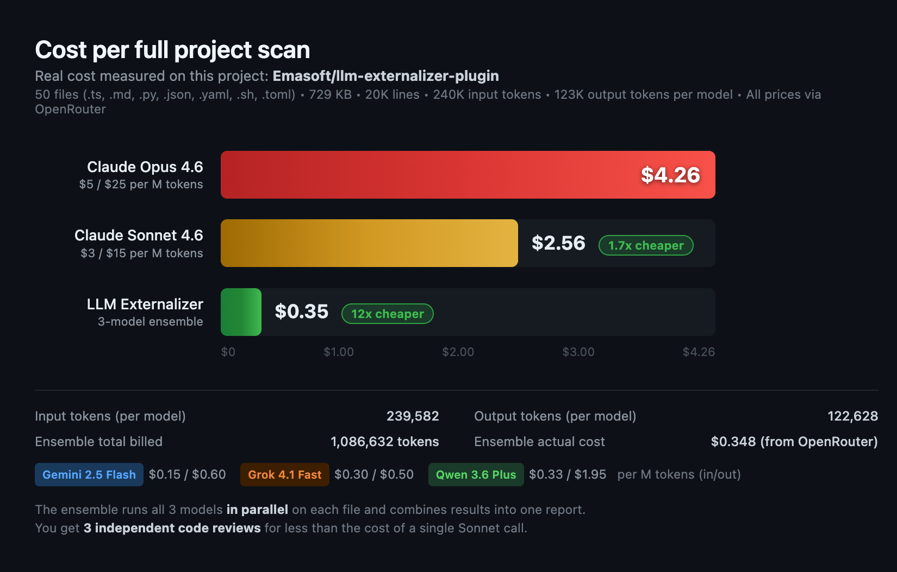

# llm-externalizer

<!--BADGES-START-->


<!--BADGES-END-->

A Claude Code plugin that offloads bounded LLM tasks to cheaper local or remote models via MCP. Supports local backends (LM Studio, Ollama, vLLM, llama.cpp) and remote backends (OpenRouter) with profile-based configuration and ensemble mode.

### Cost comparison



## Features

- **13 MCP tools** — 8 read-only analysis tools + 5 utility tools
- **Profile-based configuration** — named profiles in `~/.llm-externalizer/settings.yaml`
- **Ensemble mode** — two models in parallel on OpenRouter, combined report
- **Auto-batching** — large file sets split automatically to fit context window
- **File grouping** — organize files into named groups (`---GROUP:id---`) for isolated per-group reports
- **Secret scanning** — detects API keys and tokens before sending to LLM
- **User-defined regex redaction** — `redact_regex` parameter to redact custom patterns
- **Robust batch processing** — `max_retries` parameter with parallel execution, retry, and circuit breaker on all tools
- **File-based output** — all results saved to files, only paths returned (keeps orchestrator context clean)
- **2 auto-discovered skills** — tool usage patterns and configuration management
- **2 slash commands** — health check and profile management
- **6 backend presets** — LM Studio, Ollama, vLLM, llama.cpp, generic local, OpenRouter

## MCP Tools

### Read-only analysis tools

| Tool | Purpose |
|------|---------|
| `chat` | General-purpose: summarize, compare, translate, generate text. Supports `system` persona. Accepts `folder_path` for directory scanning |
| `code_task` | Code-optimized analysis with code-review system prompt. Supports `language` hint. Accepts `folder_path` for directory scanning |
| `batch_check` | **Deprecated** — use any tool with `answer_mode: 0, max_retries: 3`. Per-file processing with retry |
| `scan_folder` | Recursively scan a directory, auto-discover files by extension, process each with LLM |
| `compare_files` | Compare files in 3 modes: pair (2 files), batch (`file_pairs`), or git diff (`git_repo` + refs). LLM summarizes differences |
| `check_references` | Auto-resolve local imports, send source+dependencies to LLM to validate symbol references. Accepts `folder_path` |
| `check_imports` | Two-phase — LLM extracts all import paths, server validates each exists on disk. Accepts `folder_path` |
| `check_against_specs` | Compare source files against a specification file. Reports violations only. Accepts `folder_path`, `input_files_paths`, or both combined |

### Utility tools

| Tool | Purpose |
|------|---------|
| `discover` | Check service health, context window, concurrency mode, profiles, auth status |
| `reset` | Full soft-restart — waits for running requests, reloads settings, clears caches |
| `change_model` | Switch model in active profile |
| `get_settings` | Copy settings.yaml to output dir for editing (returns file path only) |
| `set_settings` | Read YAML from file, validate, backup old settings, write new. Rejects invalid configs |

### Standard input fields (all content tools)

| Field | Description |
|-------|-------------|
| `instructions` | Task text (unfenced, placed before files) |
| `instructions_files_paths` | Path(s) to instruction files (appended to instructions). Use for reusable prompts |
| `input_files_paths` | Path(s) to content files (code-fenced by server). **Always prefer this over inline content** |
| `input_files_content` | Inline content (DISCOURAGED — wastes orchestrator context tokens) |

### Advanced parameters (all content tools)

| Parameter | Default | Description |
|-----------|---------|-------------|
| `answer_mode` | 0 | 0=one report per file (default, each containing all ensemble model outputs), 1=per-request, 2=merged |
| `output_dir` | `reports_dev/llm_externalizer/` | Custom output directory for reports. Absolute path |
| `max_retries` | 1 | Max retries per file in mode 0. Set 3 for parallel + retry + circuit breaker. Available on `chat`, `code_task`, `check_references`, `check_imports`, `check_against_specs` |
| `redact_regex` | (none) | JavaScript regex to redact matching strings before sending to LLM. Alphanumeric matches become `[REDACTED:USER_PATTERN]` |
| `scan_secrets` | false | Abort if API keys/tokens/passwords detected in input files |
| `redact_secrets` | false | Replace detected secrets with `[REDACTED:LABEL]` |
| `max_payload_kb` | 400 | Max payload per batch in KB |
| `folder_path` | (none) | Absolute path to a folder to scan. Can be combined with `input_files_paths`. Available on `chat`, `code_task`, `check_references`, `check_imports`, `check_against_specs` |
| `extensions` | (all) | File extensions filter when using `folder_path`, e.g. `[".ts", ".py"]`. Omit to scan all non-binary files |
| `exclude_dirs` | (none) | Additional directory names to skip beyond defaults (`node_modules`, `.git`, `dist`, `build`, `.venv`, `.idea`, `tmp`, `vendor`, etc.) |
| `recursive` | true | Recurse into subdirectories when scanning `folder_path` |
| `follow_symlinks` | true | Follow symbolic links (circular symlinks auto-detected and skipped) |
| `max_files` | 2500 | Maximum number of files to discover from `folder_path` |
| `use_gitignore` | true | Use `.gitignore` rules to filter files. Handles submodules and nested git repos. Set `false` to include gitignored files |

### File grouping

Organize files into named groups for isolated processing — n groups in, n reports out:

```json
{
  "input_files_paths": [
    "---GROUP:auth---",
    "/path/to/auth.ts",
    "/path/to/auth.test.ts",
    "---/GROUP:auth---",
    "---GROUP:api---",
    "/path/to/routes.ts",
    "---/GROUP:api---"
  ]
}
```

Each group produces its own report: `[group:auth] /path/to/report_group-auth_...md`. Groups apply to `input_files_paths` (and `file_pairs` in `compare_files`), not instructions or spec files. No markers = backward compatible.

### Ensemble mode

On OpenRouter (`remote-ensemble` profile), requests run on **three models in parallel** with results combined in one report. If one or two models fail (removed, rate-limited, timed out), the report includes results from the surviving models — only errors if all three fail.

**Default ensemble models:**

| Model | Role | Pricing (per 1M tokens) | File size limit |
|-------|------|------------------------|-----------------|
| `google/gemini-2.5-flash` | Primary | $0.15 input / $0.60 output | ≤50K lines |
| `x-ai/grok-4.1-fast` | Secondary | $0.30 input / $0.50 output | ≤20K lines |
| `qwen/qwen3.6-plus` | Tertiary (reasoning) | $0.33 input / $1.95 output | ≤40K lines |

| Parameter | Default | Description |
|-----------|---------|-------------|
| `ensemble` | `true` (on OpenRouter) | Set `false` for simple tasks to save tokens |
| `max_tokens` | model maximum (65,535) | Auto-managed, not user-configurable |
| `temperature` | 0.1 (fixed) | Optimized for factual/code analysis. Not user-configurable |

### Rate limiting

Rate limiting is **fully automatic** — no configuration needed.

- **RPS auto-detected** from OpenRouter balance ($1 ≈ 1 RPS, max 500)
- **Adaptive AIMD**: halves RPS on 429 errors, increases by 1 after 10 consecutive successes
- **Up to 200 requests in-flight** simultaneously
- **Heartbeat** every 30s keeps MCP connection alive during long batches

### Key constraints

- **600s base timeout** per LLM request. Extended automatically when reasoning models (Qwen, etc.) are actively thinking — no hard cap during reasoning
- **No project context** — the remote LLM knows nothing about your project; always include brief context in instructions
- **File paths only** — always use `input_files_paths`, never paste file contents into instructions
- **Output location** — all responses saved to `reports_dev/llm_externalizer/` in the project directory. Customizable via `output_dir` parameter

### Subagent access

**Regular subagents** (spawned by Claude Code via the Agent tool) can use all LLM Externalizer MCP tools — they inherit the parent session's tool access.

**Plugin-shipped agents** (`.md` files in a plugin's `agents/` directory) **cannot** use MCP servers. Claude Code strips `mcpServers` and `hooks` from plugin agent frontmatter for security. This means a plugin agent cannot start the LLM Externalizer MCP server.

**Solution:** The plugin ships `bin/llm-ext`, a CLI wrapper that any agent can call via the Bash tool. No MCP access needed — it spawns the server, executes one tool call, and returns the result.

To enable LLM Externalizer in your plugin agent, add this snippet to the agent's `.md` file instructions:

```markdown
## LLM Externalizer (external model analysis)

You have access to the LLM Externalizer CLI for offloading analysis tasks to cheaper external LLMs.
The CLI is at: node "${CLAUDE_PLUGIN_ROOT}/bin/llm-ext"

FIRST, discover available tools and their parameters:
  node "${CLAUDE_PLUGIN_ROOT}/bin/llm-ext" --help
  node "${CLAUDE_PLUGIN_ROOT}/bin/llm-ext" --help <tool_name>

THEN, call the appropriate tool. Examples:
  node "${CLAUDE_PLUGIN_ROOT}/bin/llm-ext" code_task --instructions "Find bugs" --input_files_paths /path/to/file.ts
  node "${CLAUDE_PLUGIN_ROOT}/bin/llm-ext" chat --instructions "Summarize" --folder_path /path/to/src --extensions '[".ts"]'
  node "${CLAUDE_PLUGIN_ROOT}/bin/llm-ext" discover

The output is a file path to the saved report. Read the report with the Read tool.
All parameters use --key value syntax. Arrays use JSON: --extensions '[".ts",".py"]'
Timeout: 10 minutes. Paths: absolute paths recommended.
```

The agent will call `--help` first to learn the available tools and parameters, then select the right command for its task.

## Prerequisites

- **Node.js >= 18** and **npm** — to build the bundled MCP server
- **Python >= 3.12** — build, statusline, and publishing scripts (all scripts are Python, no shell scripts)
- For local backends: a running LM Studio, Ollama, vLLM, or llama.cpp server
- For remote backends: an OpenRouter API key (`OPENROUTER_API_KEY` environment variable)

> **Note**: The `mcp-server/` directory contains the bundled TypeScript MCP server source, build output, and server manifest. It is built during installation via `scripts/setup.py`.

## Naming

- **Plugin name**: `llm-externalizer` — this is the name in `plugin.json` and what you use with `claude plugin install`
- **GitHub repo**: [`Emasoft/llm-externalizer-plugin`](https://github.com/Emasoft/llm-externalizer-plugin) — where the source code lives

The plugin name and repo name are intentionally different. When installing or referencing the plugin, always use `llm-externalizer` (the plugin name), not `llm-externalizer-plugin` (the repo name).

## Installation

### From the emasoft-plugins marketplace (recommended)

```bash
# Add the marketplace (first time only)
claude plugin marketplace add Emasoft/emasoft-plugins

# Update the marketplace index to get the latest plugin list
claude plugin marketplace update emasoft-plugins

# Install the plugin
claude plugin install llm-externalizer@emasoft-plugins
```

Restart Claude Code to activate.

> **Note**: If `claude plugin install` says "not found", run `claude plugin marketplace update emasoft-plugins` first to refresh the local marketplace cache.

### Alternative: manual settings.json

Add the marketplace and enable the plugin in `~/.claude/settings.json`:

```json
{
  "pluginMarketplaces": [
    "Emasoft/emasoft-plugins"
  ],
  "enabledPlugins": {
    "llm-externalizer@emasoft-plugins": true
  }
}
```

Restart Claude Code or run `/reload-plugins` to activate.

### Manual installation (development)

```bash
# Clone the plugin repo directly
git clone https://github.com/Emasoft/llm-externalizer-plugin.git /tmp/llm-externalizer-plugin

# Build the MCP server
cd /tmp/llm-externalizer-plugin
python3 scripts/setup.py

# Install from local path
claude plugin install /tmp/llm-externalizer-plugin
```

## Setup

After installation, the MCP server needs to be built (the marketplace install triggers `scripts/setup.py` automatically):

```bash
python3 scripts/setup.py
```

On first run, the server creates a settings template at `~/.llm-externalizer/settings.yaml` with 4 predefined profiles.

### Optional: statusline

```bash
python3 $CLAUDE_PLUGIN_ROOT/scripts/install_statusline.py
```

Shows model, context usage, and cost stats in the Claude Code status bar.

### Verify

```bash
# Inside Claude Code, run the discover command:
/llm-externalizer:discover
```

This shows service health, active profile, model, auth token status, and available profiles.

## Configuration

Settings at `~/.llm-externalizer/settings.yaml`. Use `/llm-externalizer:configure` to manage profiles interactively, or edit the YAML directly.

### Quick start with OpenRouter

```yaml
active: remote-ensemble

profiles:
  remote-ensemble:
    mode: remote-ensemble
    api: openrouter-remote
    model: "google/gemini-2.5-flash"
    second_model: "x-ai/grok-4.1-fast"
    api_key: $OPENROUTER_API_KEY
```

### Quick start with LM Studio (local)

```yaml
active: local

profiles:
  local:
    mode: local
    api: lmstudio-local
    model: "bartowski/Llama-3.3-70B-Instruct-GGUF"
```

### Supported backends

| Preset | Protocol | Default URL | Auth |
|--------|----------|-------------|------|
| `lmstudio-local` | LM Studio native API | `http://localhost:1234` | `$LM_API_TOKEN` |
| `ollama-local` | OpenAI-compatible | `http://localhost:11434` | (none) |
| `vllm-local` | OpenAI-compatible | `http://localhost:8000` | `$VLLM_API_KEY` |
| `llamacpp-local` | OpenAI-compatible | `http://localhost:8080` | (none) |
| `generic-local` | OpenAI-compatible | (url required) | `$LM_API_TOKEN` |
| `openrouter-remote` | OpenRouter API | `https://openrouter.ai/api` | `$OPENROUTER_API_KEY` |

### Profile modes

| Mode | Behavior |
|------|----------|
| `local` | Sequential requests to a local server |
| `remote` | Parallel requests, single model via OpenRouter |
| `remote-ensemble` | Parallel requests, two models in parallel, combined report |

### Environment variables

| Variable | Used by | Description |
|----------|---------|-------------|
| `OPENROUTER_API_KEY` | `openrouter-remote` | OpenRouter API key |
| `LM_API_TOKEN` | `lmstudio-local`, `generic-local` | Local server auth token |
| `VLLM_API_KEY` | `vllm-local` | vLLM server auth key |

Auth is auto-detected from environment. Profile fields `api_key` / `api_token` can override with `$OTHER_VAR` or a direct value.

## Skills (auto-discovered)

| Skill | Description |
|-------|-------------|
| **llm-externalizer-usage** | Tool reference, usage patterns, file grouping, advanced parameters, end-to-end workflows |
| **llm-externalizer-config** | Profile management, settings workflow, validation rules, ensemble configuration, troubleshooting |

Skills activate automatically when Claude Code encounters tasks matching their trigger descriptions.

## Commands

| Command | Description |
|---------|-------------|
| `/llm-externalizer:discover` | Check health, active profile, model, auth status, context window |
| `/llm-externalizer:configure` | List, switch, or add profiles (`list`, `switch <name>`, `add <name> --mode ... --api ... --model ...`) |

## Plugin Structure

```
llm-externalizer-plugin/
├── .claude-plugin/
│   └── plugin.json               # Plugin manifest
├── .github/
│   └── workflows/
│       └── notify-marketplace.yml # Auto-notify emasoft-plugins on version bump
├── .mcp.json                     # MCP server configuration
├── bin/
│   ├── llm-externalizer          # Standalone MCP server launcher (stdio)
│   └── llm-ext                   # CLI wrapper for Bash-based tool invocation
├── commands/
│   ├── configure.md              # /llm-externalizer:configure
│   └── discover.md               # /llm-externalizer:discover
├── mcp-server/                   # Bundled TypeScript MCP server
│   ├── src/
│   │   ├── index.ts              # Main server (tool definitions, request handling)
│   │   ├── config.ts             # Settings management, profile loading
│   │   └── cli.ts                # CLI entry point
│   ├── package.json
│   ├── tsconfig.json
│   ├── server.json               # MCP server manifest
│   └── statusline.py             # Status bar script (cross-platform)
├── scripts/                      # All Python, no shell scripts
│   ├── setup.py                  # Build: npm install + npm run build
│   ├── install_statusline.py     # Statusline installer
│   ├── bump_version.py           # Semver bumper for plugin.json
│   └── publish.py                # Release pipeline (bump, changelog, tag, push, gh release)
├── skills/
│   ├── llm-externalizer-usage/
│   │   ├── SKILL.md
│   │   ├── references/
│   │   │   ├── tool-reference.md
│   │   │   └── usage-patterns.md
│   │   └── examples/
│   │       └── end-to-end-workflow.md
│   └── llm-externalizer-config/
│       ├── SKILL.md
│       └── references/
│           ├── configuration-guide.md
│           └── profile-templates.md
├── .gitignore
├── LICENSE
└── README.md
```

## Publishing

Releases are created with the `publish.py` script. A pre-push hook acts as a quality gate on every push to main.

### Publish script

```bash
uv run scripts/publish.py              # bump patch (default)
uv run scripts/publish.py --minor      # minor bump
uv run scripts/publish.py --major      # major bump
uv run scripts/publish.py --set 4.0.0  # explicit version
uv run scripts/publish.py --dry-run    # preview without changes
```

The script performs these steps in order:

1. **Bump version** — always bumps (marketplace needs change to detect updates). Syncs to `plugin.json`, `package.json`, `server.json`, `index.ts`
2. **Rebuild dist** — bundles TypeScript with new version
3. **Validate** — build check + CPV plugin validation (0 issues required)
4. **Badges** — updates `README.md` version/build badges
5. **Changelog** — regenerates `CHANGELOG.md` via `git-cliff`
6. **Commit** — commits all version-bumped files
7. **Tag** — creates annotated git tag (`vX.Y.Z`)
8. **Push** — pushes (pre-push hook skips — publish.py already validated)
9. **GitHub release** — creates release via `gh` CLI

## Requirements

| Requirement | Version | Purpose |
|-------------|---------|---------|
| Node.js | >= 18 | Build and run MCP server |
| npm | >= 8 | Install dependencies |
| Python | >= 3.12 | Build, statusline, and publishing scripts |
| `uv`/`uvx` | any | Run publish/bump scripts + CPV validation |
| `gh` | any | GitHub releases (publish.py) |
| `git-cliff` | any | Changelog generation (required for publish) |

## Links

- **Marketplace**: [Emasoft/emasoft-plugins](https://github.com/Emasoft/emasoft-plugins)
- **Repository**: [Emasoft/llm-externalizer-plugin](https://github.com/Emasoft/llm-externalizer-plugin)
- **MCP Server Source**: Bundled in `mcp-server/` directory

## License

MIT
