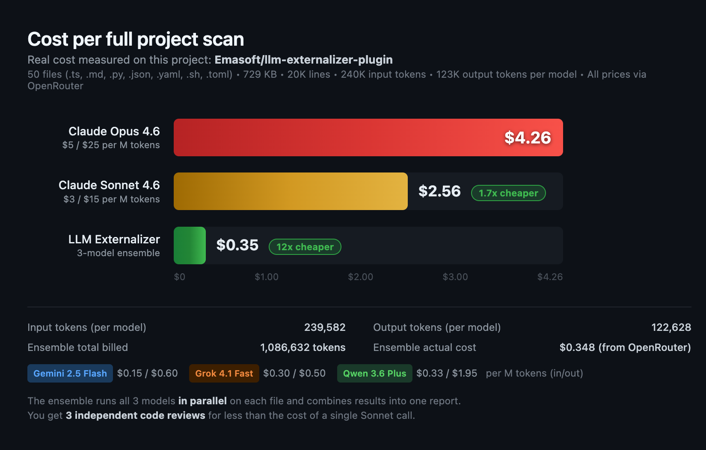

<p align="center">
  
</p>

# llm-externalizer

<!--BADGES-START-->
<p align="center">
<a href="#"></a>
<a href="#"></a>
<a href="#"></a>
<a href="#"></a>
<a href="#"></a>
<a href="https://github.com/Emasoft/emasoft-plugins"></a>
<a href="#"></a>
</p>
<!--BADGES-END-->

<p align="center">
<b>Offload expensive code-scan work to cheap LLMs. Keep the fix loop local in Claude Code.</b>
</p>

---

## What it does

This plugin helps you review a codebase with a cheap model, and then fix the findings with your normal Claude Code session.

The work splits in two halves:

- **The scan** — reading your files and listing what looks wrong (bugs, spec violations, duplicate code, broken imports). This half is sent to an inexpensive model of your choice: a free remote one, a paid remote ensemble of three models, or a local model running on your own machine.
- **The fix** — actually editing the code to resolve each finding. This half stays inside Claude Code and is done by Claude Sonnet or Opus, so you keep the same review-and-approve flow you already use for any edit.

Keeping the fix half local means the expensive model only touches code when it actually needs to. The scan half does all the slow reading work on the cheap side.

<p align="center">
  
  <br><sub><em>Scan target: ~38 KLOC TypeScript repo. Per-run cost on OpenRouter — measured 2026-05.</em></sub>
</p>

---

## Table of contents

- [How it works](#how-it-works)
- [Features](#features)
- [Requirements](#requirements)
- [Install](#install)
- [First run](#first-run)
- [Plugin commands](#plugin-commands) (`/llm-externalizer:*` — what you type in Claude Code)
- [CLI commands](#cli-commands) (direct `llm-ext <command>` calls — for skills, custom agents, scripts)
- [Agents](#agents) (internal, dispatched by commands)
- [Configuration](#configuration)
- [Troubleshooting](#troubleshooting)
- [Plugin structure](#plugin-structure)
- [Contributing](#contributing)
- [License](#license)

---

## How it works

```
┌─────────────────────────────────────────────────────────────────────────┐
│  YOUR CLAUDE CODE SESSION (local — Sonnet / Opus / Haiku)               │
│                                                                         │
│   /llm-externalizer:llm-externalizer-scan-and-fix                       │
│        │                                                                │
│        │  1. auto-discover codebase via git ls-files                    │
│        │  2. run "llm-ext scan-folder" or "llm-ext code-task"  ─┐       │
│        │                                                        │       │
│        │                                                        ▼       │
│        │           ┌─────────────────────────────────────────────────┐  │
│        │           │  BUNDLED CLI ENGINE (llm-ext, in the plugin)    │  │
│        │           │                                                 │  │
│        │           │  FFD-batches files into ~400 KB payloads        │  │
│        │           │  Streams each batch to the configured backend:  │  │
│        │           │    • OpenRouter ensemble (3 models in parallel) │  │
│        │           │    • OpenRouter single model                    │  │
│        │           │    • LM Studio / Ollama / vLLM / llama.cpp      │  │
│        │           │    • Nemotron free tier                         │  │
│        │           │                                                 │  │
│        │           │  Writes per-file / per-group / merged reports   │  │
│        │           │  to ./reports/llm-externalizer/*.md             │  │
│        │           └─────────────────────────────────────────────────┘  │
│        │                                                        │       │
│        │  3. receive report paths (only paths — never bodies)   │       │
│        │  4. dispatch FIXER SUBAGENTS (local Claude Sonnet/Opus)        │
│        │       • parallel: up to 15 concurrent, one per report          │
│        │       • serial:   one bug at a time from an aggregated list    │
│        │                                                                │
│        │     EACH FIXER subagent:                                       │
│        │       a. reads ONE report from disk                            │
│        │       b. verifies every finding against the real source        │
│        │       c. rejects false positives / hallucinations              │
│        │       d. applies a minimal Edit only on REAL defects           │
│        │       e. runs the language linter, re-verifies                 │
│        │       f. writes a .fixer.*.md summary                          │
│        │                                                                │
│        │  5. join-script merges all fixer summaries into one report     │
└─────────────────────────────────────────────────────────────────────────┘
```

**One-line summary.** The `llm-ext` CLI is the scan engine; your Claude Code session is the fix engine. Only file paths cross the boundary — the orchestrator context never reads a report body.

---

## Features

- **Interactive setup wizard** (`/llm-externalizer:llm-externalizer-setup`, since v9.6.0) — detects your platform (OS, arch, RAM, GPU), finds installed runners (Ollama, LM Studio, vLLM, llama.cpp, Jan), helps download a Hugging Face model with the `hf` CLI, runs five calibrated compatibility tests on the chosen model, and emits a paste-ready `settings.yaml` profile snippet via a stdlib-only generator (`scripts/setup/build-snippet.py`). The wizard NEVER writes to your `settings.yaml` — user-only-configuration policy.
- **Scan externalization** — 44 CLI commands for code review, duplicate hunting, import/reference validation, spec-compliance checks, bulk LLM-driven structured-output extraction (mass-scouting), full-sentence meaning-equivalence clustering (`cluster-synonyms`), injection-hardened security triage (`security-scan`), a $0 delegate mode (`review-plan`) where the host agent reviews with its own model, layered per-path review rules (`rules-check` debugs which rule fires), and diff-mode scoping on every review tool (`--diff_workspace`, `--diff_from/--diff_to`, `--diff_commit` — git-delegated, hunks carry enclosing-function context), all backed by a local or remote LLM you choose.
- **Dry-run everything before paying** — `--estimate` predicts a run's cost (expected + hard ceiling, self-calibrating from recorded usage) and `--preview` lists exactly which files would be scanned and WHY each exclusion happened; both compose, both send nothing.
- **Fix loop stays local** — fixes are applied by your Claude Code Sonnet / Opus session, NOT by the external LLM. You get the ensemble's second opinion without giving up editorial control.
- **False-positive-aware fixers** — every fixer subagent runs a verification pass (file-read + flow-trace) before editing. Empirically ~15–30% of ensemble findings are false positives; the fixer rejects them with a typed reason.
- **40 plugin commands** — 23 base (`setup`, `discover`, `reset`, `configure`, `change-model`, `install-statusline`, `update-all`, `benchmark`, `bench-free-pool`, `assess-model`, `check-model-health`, `discover-new-models`, `security-triage-benchmark`, `search-existing-benchmark`, `auto-replace`, `search-existing-implementations`, `cluster-synonyms`, `scan-and-fix`, `scan-and-fix-serially`, `fix-report`, `fix-found-bugs`, `high-quality-scan`, `high-quality-scan-and-fix`) + 16 mass-scout (`mass-scout-register`, `mass-scout-preclassify`, `mass-scout-estimate`, `mass-scout`, `mass-scout-search`, `mass-scout-search-xjob`, `mass-scout-get`, `mass-scout-export`, `mass-scout-jobs-list`, `mass-scout-audit-sample`, `mass-scout-body-get`, `mass-scout-build-fieldset`, `mass-scout-propose-fieldset`, `mass-scout-list-bundled-fieldsets`, `mass-scout-diff`, `mass-scout-chain`) + 1 dedicated security tool (`security-scan`). Full list in [Plugin commands](#plugin-commands). Note: `/llm-externalizer:llm-externalizer-change-model` is a *user-only* redirect — it shows your current config (`discover`/`get-settings`) and guides you to edit `~/.llm-externalizer/settings.yaml` by hand, then reload via `reset`. There is no `change-model` or `set-settings` CLI command (the CLI is read-only by design). Model / profile changes always go through editing `~/.llm-externalizer/settings.yaml` (or running the setup wizard above).
- **44 CLI commands** — 21 core/utility (`chat`, `code-task`, `scan-folder`, `high-quality-scan`, `compare-files`, `check-references`, `check-imports`, `check-against-specs`, `search-existing-implementations`, `cluster-synonyms`, `batch-check`, `review-plan`, `rules-check`, `discover`, `reset`, `get-settings`, `profile`, `session-summary`, `or-model-info`, `or-model-info-table`, `or-model-info-json`) + 16 mass-scout (`mass-scout-register`, `mass-scout-preclassify`, `mass-scout-estimate`, `mass-scout`, `mass-scout-search`, `mass-scout-search-xjob`, `mass-scout-get`, `mass-scout-export`, `mass-scout-jobs-list`, `mass-scout-audit-sample`, `mass-scout-body-get`, `mass-scout-build-fieldset`, `mass-scout-propose-fieldset`, `mass-scout-list-bundled-fieldsets`, `mass-scout-diff`, `mass-scout-chain`) + 7 security / model-qualification (`security-scan`, `security-triage-benchmark`, `search-existing-benchmark`, `assess-model`, `check-model-health`, `discover-new-models`, `check-tool-replacements`). The CLI is **read-only by design** — there are no `set-settings`, `change-model`, `fix-code`, `batch-fix`, `merge-files`, `split-file`, `revert-file`, or `custom-prompt` commands (configuration is user-only; `custom_prompt` was merged into `chat`). The `max_retries: 3` parameter on per-file commands (chat/code-task/scan-folder) replaces the older `batch-check` workflow (parallel execution + exponential backoff + circuit breaker); `batch-check` itself is DEPRECATED.
- **6 internal agents** — setup wizard + reviewer + 4 fixer variants (parallel/serial × Sonnet/Opus). The setup-agent ships with five preloaded Hugging Face helper skills (`huggingface-best`, `huggingface-local-models`, `huggingface-mlx-models`, `hf-cli`, `huggingface-community-evals`) — all marked `user-invocable: false`. See [Agents](#agents).
- **3 backend modes** — `local` (sequential), `remote` (parallel, single model), `remote-ensemble` (parallel, three models → combined report).
- **6 backend presets** — LM Studio, Ollama, vLLM, llama.cpp, generic local, OpenRouter.
- **Auto-batching** — First-Fit-Decreasing bin-packing packs 1–5 files per LLM request (~400 KB per batch). The LLM never sees the whole codebase at once.
- **File grouping** — `---GROUP:<id>---` markers in a file list pack related files into one request and produce one report per group.
- **Secret handling** — every file is run through the pre-scan secret detector (`scan_secrets: true`) before it leaves your machine, and any hit is rewritten to `[REDACTED:LABEL]` (`redact_secrets: true`) so the scan still completes on partially-dirty inputs. The detector's `SECRET_PATTERNS` set now includes wildcard variants for the common API-key shapes (`sk-…`, `gho_…`, `aws_…`, etc.) and prefix-bearing tokens, so accidental leaks via `.env`, fixtures, or stale comments are caught and silently masked instead of being shipped to the remote LLM. Opt out per run with `--no-secrets` only after you have moved secrets to a gitignored `.env`.
- **File-based output** — every report lands in `./reports/llm-externalizer/`. Only paths flow through the orchestrator context (≤ 200 bytes per report).
- **Cross-platform** — macOS, Linux, Windows. `llm-ext` is a bundled Node executable; the helper scripts are pure Python 3.12+.

---

## Requirements

> These are the **user** requirements for installing from the marketplace.
> Additional tools for building from source are listed under [Contributing → Developer requirements](#developer-requirements).

| Tool | Minimum | Why |
|---|---|---|
| **Claude Code** | 2.0+ | Host for the plugin |
| **Node.js + npm** | Node ≥ 18 | The install hook rebuilds the bundled `llm-ext` CLI |
| **Python** | ≥ 3.12 | Install hook runs `scripts/setup.py`; statusline is Python |
| **git** | any recent | `git ls-files` / `git rev-parse` drive codebase auto-discovery |
| **ONE backend** | — | Either an OpenRouter API key **or** a local model server (LM Studio, Ollama, vLLM, llama.cpp) |

---

## Install

Every step below is a **single pasteable block**. Run them in your terminal — not inside a Claude Code session.

### 1 · Add the marketplace

<details open>
<summary><b>macOS / Linux</b> (bash / zsh)</summary>

```bash
# Add the marketplace that hosts this plugin
claude plugin marketplace add Emasoft/emasoft-plugins
```
</details>

<details>
<summary><b>Windows</b> (PowerShell)</summary>

```powershell
# Add the marketplace that hosts this plugin
claude plugin marketplace add Emasoft/emasoft-plugins
```
</details>

### 2 · Install the plugin

```bash
# Install llm-externalizer from the Emasoft marketplace
claude plugin install llm-externalizer@emasoft-plugins
```

Then restart Claude Code (or `/reload-plugins` inside a running session).

### 3 · (Later) Update the plugin

```bash
# Pull the newest version published in the marketplace
claude plugin update llm-externalizer@emasoft-plugins
```

### 4 · (Optional) Uninstall

```bash
# Remove the plugin
claude plugin uninstall llm-externalizer@emasoft-plugins
```

### Install from inside Claude Code

If you prefer conversational install, paste this repo URL in Claude and ask it to install the plugin:

```
https://github.com/Emasoft/llm-externalizer-plugin
```

---

## First run

### 0 · Run the setup wizard (recommended)

The fastest path is the bundled interactive wizard:

```
/llm-externalizer:llm-externalizer-setup
```

The wizard inspects your platform (OS, arch, RAM, GPU), looks for installed local-model runners (Ollama, LM Studio, vLLM, llama.cpp, Jan), helps you install one if none is present, downloads a Hugging Face model via the `hf` CLI (installing it on demand), runs five calibrated compatibility tests (smoke / structured output / code understanding / long context / output length), and finishes by printing a ready-to-paste `settings.yaml` profile snippet generated by `scripts/setup/build-snippet.py`. The wizard **never** writes to your `settings.yaml` — it stays user-only by policy. On Apple Silicon the wizard cross-links the [`vllm-metal-setup`](skills/vllm-metal-setup/SKILL.md) and [`vmlx-setup`](skills/vmlx-setup/SKILL.md) skills for MLX-native serving paths.

Manual options A–D below remain fully supported for users who want explicit control over which backend, model, and profile structure to use. Pick one of them if you already know your stack, or skip back here for the wizard if anything goes wrong. For the complete manual path — settings.yaml schema, the per-platform / per-GPU backend matrix, model sizing, and troubleshooting — see [`docs/setup-and-configuration.md`](docs/setup-and-configuration.md).

### 1 · Configure a backend

Pick **one** of the following backends. The four most common are below; vLLM and llama.cpp follow the same shape — see [Configuration → E. Local — vLLM or llama.cpp](#configuration).

<details open>
<summary><b>A. OpenRouter (ensemble — recommended for best quality, paid)</b></summary>

You have **three ways** to give the plugin your OpenRouter key. They are listed in order of preference — the first is **strongly recommended**.

#### 1. Shell environment variable (recommended)

Export `OPENROUTER_API_KEY` in your shell rc file. **Every** consumer in this plugin picks it up automatically: the statusline (🏦 remaining-credit panel), the `llm-ext` CLI, and any subprocess Claude Code spawns. Nothing else to configure.

<details open>
<summary>macOS / Linux (bash / zsh / fish)</summary>

```bash
# Put this in ~/.zshrc, ~/.bashrc, or ~/.config/fish/config.fish
export OPENROUTER_API_KEY="sk-or-v1-..."
```
</details>

<details>
<summary>Windows (PowerShell — persistent)</summary>

```powershell
# Persist for your user account (survives reboot and new terminals)
[Environment]::SetEnvironmentVariable("OPENROUTER_API_KEY", "sk-or-v1-...", "User")
```
</details>

<details>
<summary>Windows (cmd.exe — persistent)</summary>

```bat
setx OPENROUTER_API_KEY "sk-or-v1-..."
```
</details>

#### 2. settings.yaml `api_key` field (supported, not recommended)

You can hard-code the key (or a different env-var reference) in a profile inside `~/.llm-externalizer/settings.yaml`:

```yaml
profiles:
  remote-ensemble-geminigrok:
    mode: remote-ensemble
    api: openrouter-remote
    api_key: sk-or-v1-...        # literal — do NOT commit this file
    # api_key: $MY_CUSTOM_VAR    # or a different env-var name
```

Why this is **not** recommended: the statusline and any other subprocess that does not parse settings.yaml (CLI calls, ad-hoc scripts) will not see the key, so the 🏦 remaining-credit panel stays blank. Also: a literal key in a YAML file is one careless `git add` away from a leak.

#### 3. Claude Code plugin keychain (not functional today — see below)

Store the key in the OS keychain via Claude Code:

```bash
# Opens an interactive TUI; paste the key when prompted
claude plugin configure llm-externalizer
```

The CLI still contains a `CLAUDE_PLUGIN_OPTION_OPENROUTER_API_KEY` → `OPENROUTER_API_KEY` mapping (`resolveEnvValue()` in `scripts/llm-ext/src/config.ts`), left over from when Claude Code spawned the MCP server directly and injected that variable into it. **That injection no longer happens for this plugin.** `llm-ext` now runs the way every other tool call does — as a plain subprocess spawned via `Bash` — and this plugin's `userConfig` value is not among the variables that reach it.

Verified empirically inside a Bash tool call: `CLAUDE_PLUGIN_OPTION_OPENROUTER_API_KEY` is unset, while `discover` resolves the key whenever `OPENROUTER_API_KEY` is exported in the shell. Note the narrow shape of that result — *other* plugins' `CLAUDE_PLUGIN_OPTION_*` variables **are** visible in the same environment, so the mechanism is not globally absent and it is not worth debugging as if it were. What is missing is specifically this plugin's key.

**So treat the keychain option as non-functional for the CLI today** — exporting `OPENROUTER_API_KEY` in your shell rc (option 1) is the only reliable way to supply it.

#### Auth precedence

When more than one source is set, the resolution order is:

1. Shell env `OPENROUTER_API_KEY` (or any env var the profile's `api_key` points at via `$VAR` syntax)
2. Literal value in `settings.yaml::profiles.<name>.api_key`
3. Claude Code keychain (`userConfig.openrouter_api_key`) — **does not currently reach the CLI**; see above

The default profile `remote-ensemble-geminigrok` works out of the box once (1) or (2) is set.
</details>

<details>
<summary><b>B. OpenRouter free tier (Nemotron — free, single model)</b></summary>

Same OpenRouter key as option A (any free account works). Switch the active profile to the free one in `~/.llm-externalizer/settings.yaml` (Windows: `%USERPROFILE%\.llm-externalizer\settings.yaml`; WSL2: `\\wsl$\Ubuntu\home\<user>\.llm-externalizer\settings.yaml`):

```yaml
active: remote-free
```

See [Configuration → B. Remote free (Nemotron)](#b-remote-free-nemotron) for the full profile block.

> [!WARNING]
> The free provider logs your prompts. Use only on open-source code.
</details>

<details open>
<summary><b>B1. Free by default — the <code>allow_paid_models</code> master switch</b></summary>

**By default, the plugin uses only FREE models — everywhere, in every tool.** The
top-level `allow_paid_models` switch in `settings.yaml` governs all paid spend:

```yaml
active: remote-ensemble-mine
allow_paid_models: false      # ← DEFAULT (absent ⟺ false). Zero paid spend.
profiles:
  # ... your profiles, paid models and all ...
```

While `allow_paid_models` is **false** (the default):

- Every **remote (OpenRouter)** profile is forced to its free pool at boot,
  regardless of the `model` / `second_model` / `third_model` it configures — the
  ensemble runs 3 benchmark-vetted `:free` models. A profile with **no**
  `free_models` list still runs free: the server auto-discovers a `:free` pool at
  $0 (falling back to a bundled seed), so **nothing ever goes dark**.
- **Local** profiles are untouched — they are $0/offline, never "paid".
- Even paid **benchmarks** are refused: `--allow-paid-models-tests` cannot
  override the master switch. One switch = zero paid spend of any kind.
- `discover` reports `Free mode: ON (allow_paid_models=false)` and the actual free
  pool, so you always see what is really running.

Set `allow_paid_models: true` to use paid models (and to benchmark them); the
per-profile `free_only` below then remains an opt-in for a specific profile. This
is a behavior-changing default introduced to make free-tier the safe, zero-config
baseline — flip the switch when you deliberately want to spend.

</details>

<details>
<summary><b>B2. OpenRouter free-only ensemble (zero spend, multiple free models)</b></summary>

Set `free_only: true` on a profile to use ONLY a pool of `:free` models — the
configured `model` / `second_model` / `third_model` are ignored. The top free
models that clear the requirements floor form the ensemble; the rest are the
rate-limit fallback pool. **Every `free_models` entry MUST end with `:free`** —
the validator rejects the profile otherwise, so it can never bill.

**Free mode overrides EVERY tool.** Under `free_only`, the free pool wins over
every per-tool choice — `tool_models:` overrides, each tool's own default, the
ensemble, the rotation fallback, and even the credit-exhaustion fallback all use
only `:free` models. As a hard floor, the server **refuses to send any
non-`:free` model to OpenRouter while free mode is on** (it throws before the
request rather than spend), so a misconfiguration fails fast instead of billing.
This makes `free_only` a reliable zero-spend switch for every session that shares
this `settings.yaml`.

```yaml
active: remote-free-ensemble
profiles:
  remote-free-ensemble:
    mode: remote-ensemble
    api: openrouter-remote
    free_only: true
    api_key: $OPENROUTER_API_KEY     # free models still need the key (rate-limited, but $0)
    free_models:
      - "deepseek/deepseek-v4-flash:free"
      - "qwen/qwen3-next-80b-a3b-instruct:free"
      - "openai/gpt-oss-120b:free"
      - "z-ai/glm-4.5-air:free"
      - "meta-llama/llama-3.3-70b-instruct:free"
      - "nvidia/nemotron-3-super-120b-a12b:free"
```

Free models are heavily rate-limited; list several so the ensemble has fallbacks.
A context-window requirements floor drops obviously-unusable free models; the
golden-dataset benchmark filter is the deeper quality gate.

**Daily-limit rotation:** every free provider caps requests *per day*, so when an
ensemble slot's model returns a rate-limit / daily-limit / no-endpoints error, the
ensemble automatically rotates that slot to the next unused free model from the
pool (the ones beyond the top-3) and retries. Parallel slots claim distinct
fallbacks, so two slots never burn the same model's daily quota. List more
`free_models` than the 3 ensemble slots to give the rotation room.

**Benchmark-gate your free pool (`$0` — free models cost nothing to benchmark):**
run the security-triage benchmark on your `free_models`, then the ensemble
automatically excludes any that fail it (the pass/fail is cached in
`~/.llm-externalizer/security-triage-results.json`):

```text
security_triage_benchmark   models: ["deepseek/deepseek-v4-flash:free", "openai/gpt-oss-120b:free", ...]
```

Models never benchmarked stay in (unverified, not excluded); only a *recorded
failure* drops a model.

**Automatic free mode on low balance (no config needed).** Even on a *paid*
profile, when the OpenRouter balance drops below **$1.00** (or a `402` fires
mid-call), the server auto-engages free mode for the rest of the session: every
tool — `chat`, `code_task`, `scan_folder`, `check_*`, `compare_files`,
`cluster_synonyms`, `search_existing_implementations`, **and** `security_scan` /
`mass_scout` — routes through the bundled free pool (the same
requirements-filtered, rate-limit-rotating ensemble), so calls succeed at `$0`
instead of failing with "Budget limit exceeded" (which made agents abandon the
tool). The funded profile's models reactivate on the next server restart once
the wallet is topped up. Tune via:

| Env var | Effect |
|---|---|
| `LLM_EXT_FREE_BELOW_USD` | Balance threshold (USD) that triggers auto-free. Default `1.00`; non-finite/≤0 → `1.00`. |
| `LLM_EXT_FREE_MODEL_ID` | The single free model for the `free: true` flag + the 402 single-retry (the ensemble paths use the rotating pool). Default `poolside/laguna-m.1:free` (most-available + best security-triage of the validated pool). A non-`:free` value is rejected. |

An explicit `free_only` profile is still the way to *force* free regardless of
balance; auto-free is the safety net for the low-balance case.

> [!WARNING]
> Free providers log your prompts. Use only on open-source code.
</details>

<details>
<summary><b>C. LM Studio (local — free, offline)</b></summary>

1. Install LM Studio from <https://lmstudio.ai>, launch it, and load a model.
2. Start the local server: **Developer** → **Server** → **Start Server**.
3. Switch the plugin to the LM Studio profile by editing `settings.yaml` — see [Configuration](#configuration). On Windows the path is `%USERPROFILE%\.llm-externalizer\settings.yaml`; from WSL2 (editing the Linux-side copy) it's `\\wsl$\Ubuntu\home\<user>\.llm-externalizer\settings.yaml`.
</details>

<details>
<summary><b>D. Ollama (local — free, offline)</b></summary>

Pull a model and start the daemon:

```bash
# One-time: pull the model weights (~17 GB for Qwen3.5 27B at Q4_K_M / 4-bit MLX)
ollama pull qwen3.5:27b

# Start Ollama (or launch the tray app)
ollama serve
```

Then switch the plugin profile to `local-ollama` by editing `~/.llm-externalizer/settings.yaml` — see [Configuration](#configuration). On Windows the path is `%USERPROFILE%\.llm-externalizer\settings.yaml`; from WSL2 use `\\wsl$\Ubuntu\home\<user>\.llm-externalizer\settings.yaml`.
</details>

### 2 · Verify health

Inside Claude Code:

```
/llm-externalizer:llm-externalizer-discover
```

You should see your active profile, model ID, auth status, and `ONLINE`.

### 3 · Run your first scan + fix

```
/llm-externalizer:llm-externalizer-scan-and-fix
```

The command will auto-discover your codebase, present the file list for confirmation, run the scan, then dispatch local Claude fixer subagents that verify each finding before editing.

---

## Plugin commands

Commands are slash-invoked inside Claude Code. The format is `/llm-externalizer:llm-externalizer-<name>`.

### Base commands (18)

| Command | Purpose | Produces |
|---|---|---|
| `/llm-externalizer:llm-externalizer-setup` | Interactive setup wizard — detects platform, installs runner if needed, downloads model, runs five compatibility tests, prints paste-ready profile snippet | `settings.yaml` profile snippet (user pastes manually) |
| `/llm-externalizer:llm-externalizer-discover` | Print active profile, model, auth, context window, health | Text summary |
| `/llm-externalizer:llm-externalizer-reset` | Purge the on-disk caches (model list, concurrency, LM Studio detection) and reset session counters. Every `llm-ext` invocation is already a fresh process — there is nothing to restart and no in-flight calls to wait for | Confirmation line (active profile + model) |
| `/llm-externalizer:llm-externalizer-configure` | Read-only profile inspector (edit `settings.yaml` to change) | Profile table |
| `/llm-externalizer:llm-externalizer-change-model` | User-only redirect — shows the current config (`discover`/`get-settings`), then guides you to edit `~/.llm-externalizer/settings.yaml` by hand and reload via `reset`. There is no `change-model` CLI command; the CLI is read-only | `settings.yaml` edit guidance |
| `/llm-externalizer:llm-externalizer-install-statusline` | Install the bundled multi-tier statusline (credit balance, model, context bar, LLM tokens & cost, git, usage limits) | Updated `settings.json` |
| `/llm-externalizer:llm-externalizer-update-all` | **The whole model refresh in ONE command** — discover the live catalog, requirement-gate every tool, run every benchmark, rank, and atomically write the winners (ensemble + each `tool_models.<tool>` + the `free_models` pool). Defaults to a **provably $0** free-model refresh (incl. the free-models search); `--paid` / `--both` spend under a **hard `--budget-usd` cap** (default $2.00) that aborts *before* the first call if the pre-flight estimate exceeds it. `--dry-run` prints the plan + estimate and spends nothing | Update report + updated `settings.yaml` |
| `/llm-externalizer:llm-externalizer-benchmark` | Run the OpenRouter model-selection harness over your sample to compare candidates | Benchmark report |
| `/llm-externalizer:llm-externalizer-bench-free-pool` | Auto-fill the benchmark candidate set from the active profile's `free_models` (or the bundled `FREE_POOL_SEED`) — one flag instead of N `--include`s. Resolves the pool against the live catalog: a configured non-`:free` id is admitted only when the catalog prices it at exactly `$0` (fail-fast otherwise), and zero-cost open-beta models without a `:free` suffix (e.g. `openrouter/owl-alpha`) are auto-discovered into the sweep. Composes with `--security-triage`. The same sweep runs automatically when `free_only` flips ON and the cache has no `:free` entries (TRDD-f1510055, TRDD-WJND1N2W) | Benchmark report (zero-cost) |
| `/llm-externalizer:llm-externalizer-assess-model` | Assess one model against every LLM tool's per-tool requirements (free — no LLM call, just a public catalog fetch); shows per-tool `OK`/`NO` + which qualifying tools also need a benchmark pass | Per-tool requirements table |
| `/llm-externalizer:llm-externalizer-check-model-health` | Self-check the CONFIGURED model(s) of the active profile (free — no LLM call, one public catalog fetch): presence (removed/deprecated), cost drift vs a seeded baseline, and requirements regression per served tool. Advisory only — never changes settings | Health summary + `reports/model-health/` report |
| `/llm-externalizer:llm-externalizer-discover-new-models` | Autodiscover models that newly appeared in the OpenRouter catalog since the last run (free — no LLM call, one public catalog fetch); each new id assessed against every tool's requirements. `[qualifying-only]` hides arrivals that fit no tool. Advisory only — never changes settings | Arrivals summary + `reports/model-arrivals/` report |
| `/llm-externalizer:llm-externalizer-security-triage-benchmark` | Qualify model(s) for `security_scan` against the labeled golden dataset via the real judge pipeline; recommends the best same-or-cheaper passer (never pricier) | Recommendation + JSON/markdown report |
| `/llm-externalizer:llm-externalizer-search-existing-benchmark` | Qualify model(s) for `search_existing_implementations` against a labeled golden-fixture codebase, scored DETERMINISTICALLY (precision/recall/F1 over known duplicate locations, no LLM judge) by driving the real search-existing pipeline; recommends the best same-or-cheaper passer (never pricier) | Recommendation + JSON/markdown report |
| `/llm-externalizer:llm-externalizer-search-existing-implementations` | PR duplicate-check — "is this feature already implemented anywhere?" | Exhaustive `NO` / `YES symbol=<name> lines=<a-b>` per file |
| `/llm-externalizer:llm-externalizer-cluster-synonyms` | Cluster SENTENCES / short labels by full-sentence meaning equivalence (taxonomy / ontology / label canonicalisation, 10k–1M items). File-in, file-out, zero orchestrator tokens; resumable + budget-capped | `clusters.jsonl` + `clusters_summary.json` + `stats.json` + `checkpoint.sqlite` + counter line |
| `/llm-externalizer:llm-externalizer-scan-and-fix` | Scan whole codebase → per-file reports → parallel fixer subagents (≤15 concurrent) → joined report | Per-file scan reports + fixer summaries + joined report |
| `/llm-externalizer:llm-externalizer-scan-and-fix-serially` | Same scan; fixes bugs one at a time in a serial loop (safer when fixes touch shared state) | Per-file reports + canonical bug list + serial fixer summary |
| `/llm-externalizer:llm-externalizer-high-quality-scan` | Folder scan with ONE strong remote model (default `z-ai/glm-5.2`) at max reasoning + prompt cache, NOT the cheap ensemble. Paid + OpenRouter-only — fails fast on a local backend, `free_only`, or no credit | Per-file scan reports (or merged) |
| `/llm-externalizer:llm-externalizer-high-quality-scan-and-fix` | High-quality scan (above) → parallel **Opus** fixer subagents (≤15) verify and fix each finding in the same run | Per-file reports + Opus fixer summaries + joined report |
| `/llm-externalizer:llm-externalizer-fix-report` | Dispatch ONE fixer subagent on an already-generated scan report | One `.fixer.`-tagged summary |
| `/llm-externalizer:llm-externalizer-fix-found-bugs` | Aggregate unfixed findings from all reports in `./reports/llm-externalizer/` and fix serially | Canonical bug list + serial summary |

### Mass-scout commands (16)

| Command | Purpose | Produces |
|---|---|---|
| `/llm-externalizer:llm-externalizer-mass-scout-register` | Walk a folder / take a file list and store every body in the SQLite cache (honors `.gitignore`; `--git-diff <ref>` for incremental) | Counter line `registered=N already=M skipped_too_big=K …` |
| `/llm-externalizer:llm-externalizer-mass-scout-preclassify` | Script-only bucket tagger | Counter line per bucket |
| `/llm-externalizer:llm-externalizer-mass-scout-estimate` | Cost / time / cap-skipped numbers for a fieldset; honors `--budget-usd`; `--live-context` queries OpenRouter for the real provider cap | Numbers + per-bucket breakdown |
| `/llm-externalizer:llm-externalizer-mass-scout` | Run the LLM scout end-to-end; emits progress lines to stderr per file | Markdown report under `reports/mass_scouting/` + counter line |
| `/llm-externalizer:llm-externalizer-mass-scout-search` | Per-job search (regex bypass / FTS5 / structured / combined) | Hit list (text or `--json`) |
| `/llm-externalizer:llm-externalizer-mass-scout-search-xjob` | Cross-job federated search | Merged hit list |
| `/llm-externalizer:llm-externalizer-mass-scout-get` | Print one row by `short_id` (with optional per-job result) | JSON row |
| `/llm-externalizer:llm-externalizer-mass-scout-export` | Dump every result row of a job to JSONL or CSV under `reports/mass_scouting/` | File path |
| `/llm-externalizer:llm-externalizer-mass-scout-jobs-list` | Enumerate every job in a DB (fieldset, model, ok/total, cost, started_at). Audit "what scouts already ran here?" before starting a new one | Markdown table (or JSON array with `--json`) |
| `/llm-externalizer:llm-externalizer-mass-scout-audit-sample` | Pull N random results from a finished job alongside the cached file body — human-trust check that the model understood the files | Markdown samples (or `samples[]` JSON envelope) |
| `/llm-externalizer:llm-externalizer-mass-scout-body-get` | Print the cached file body for a `short_id`. Lets follow-up agents reason about the file without re-reading from disk | Raw file body to stdout |
| `/llm-externalizer:llm-externalizer-mass-scout-build-fieldset` | Compose a fieldset JSON from `--field` shorthand tokens (e.g. `name:bool=desc`, `name:enum(a,b,c)=desc`) without hand-writing JSON | Validated fieldset JSON (stdout or `--out` path) |
| `/llm-externalizer:llm-externalizer-mass-scout-propose-fieldset` | Ask the LLM to propose a fieldset JSON for a natural-language `--goal`, optionally seeded with sample files. Resolves the "what fields do I write?" UX cliff | Validated fieldset JSON (stdout or `--out` path) |
| `/llm-externalizer:llm-externalizer-mass-scout-list-bundled-fieldsets` | Enumerate the plugin-shipped fieldsets accepted as `--fields-file bundled:<name>` (`code-audit`, `skill-audit`, `security-audit`, `pr-review`) | Markdown list (or `[{name, path, fields}]` JSON) |
| `/llm-externalizer:llm-externalizer-mass-scout-diff` | Compare two jobs row-by-row → `only_from` / `only_to` / `identical` / `changed` (+ changed-key list). Confirms a re-scout actually changed what you expected | Markdown summary (or structured JSON) |
| `/llm-externalizer:llm-externalizer-mass-scout-chain` | Run a second scout pass on the subset of a prior job's rows that match a `--filter "$.path:OP:value"` expression, using a fresh fieldset. Drills deeper without re-scouting the whole tree | New job's mass-scout markdown report under `reports/mass_scouting/` + counter line |
| `/llm-externalizer:llm-externalizer-security-scan` | **Injection-hardened** security triage (NOT mass_scout). Adjudicates a batch of `targets[]` (snippet \| file_path+line+context_lines \| path_glob) + per-category rubrics into per-item `{verdict, confidence, reason, injection_observed}`; nonce-delimited envelope + strict json_schema + fail-safe-to-`uncertain` | JSON + markdown report under `reports/security_scan/` + counter line |

Bundled fieldsets shipped with the plugin: `code-audit`, `skill-audit`, `security-audit`, `pr-review` (pass as `--fields-file bundled:<name>`). The CLI also exposes every tool as `bin/llm-ext mass-scout-<subcommand>` — see `--help` for the full flag list.

<details>
<summary><b>Parameter reference — click to expand</b></summary>

### `/llm-externalizer:llm-externalizer-discover`
No parameters.

### `/llm-externalizer:llm-externalizer-configure`
No parameters. Read-only; edit `~/.llm-externalizer/settings.yaml` directly then run `llm-ext reset` (or restart).

### `/llm-externalizer:llm-externalizer-search-existing-implementations`

| Parameter | Kind | Required | Default | Meaning |
|---|---|---|---|---|
| `<feature-description>` | positional string | yes | — | Natural-language description of the feature to search for |
| `<codebase-path>` | positional path | yes | — | Root folder to scan (respects `.gitignore` in git repos). Accepts multiple roots |
| `--source-files <path>...` | repeated | no | — | Reference source files showing the feature. Passed as context per batch; auto-excluded from the scan |
| `--diff <path>` | file path | no | — | Unified-diff file to narrow scope. Mutually exclusive with `--base` |
| `--base <ref>` | git ref | no | auto-detect `origin/HEAD` → `main` → `master` | Auto-generate diff via `git diff <ref>...HEAD` |
| `--max-files <N>` | integer | no | `10000` | File cap — higher than `scan_folder`'s 2500 because duplicate hunts scan the whole codebase |
| `--free` | flag | no | off | Use the free Nemotron model. Provider logs prompts — avoid on proprietary code |

### `/llm-externalizer:llm-externalizer-scan-and-fix`

| Parameter | Kind | Required | Default | Meaning |
|---|---|---|---|---|
| `[target]` | positional path | no | **auto-discover whole codebase** | If both `[target]` and `--file-list` are omitted: `git rev-parse --show-toplevel` → `git ls-files` → filters docs/examples/fixtures/binaries/lock-files → presents the curated list for confirmation |
| `--file-list <path>` | file path | no | — | `.txt` with ONE absolute path per line, or `---GROUP:<id>---` / `---/GROUP:<id>---` marker lines. `[target]` is ignored when set |
| `--instructions <path>` | `.md` path | no | built-in REAL-BUGS-ONLY rubric | Replaces the default audit rubric |
| `--specs <path>` | `.md` path | no | — | Spec file. Each batch sees source + spec, so refs are validated against the authoritative list |
| `--free` | flag | no | off | Free Nemotron model (provider logs prompts) |
| `--no-secrets` | flag | no | off | **Default is scan+redact.** This flag turns OFF both (no detection, no redaction). Use only after moving secrets to `.env` |
| `--text` | flag | no | off | Include `.md .txt .json .yml .yaml .toml .ini .cfg .conf .xml .html .rst .csv`. Pair with `--instructions` |

### `/llm-externalizer:llm-externalizer-scan-and-fix-serially`
Same parameters as `scan-and-fix`. Fix phase differs: one fixer subagent at a time, one bug at a time.

### `/llm-externalizer:llm-externalizer-fix-report`

| Parameter | Kind | Required | Default | Meaning |
|---|---|---|---|---|
| `@<scan-report.md>` or bare path | positional path | yes | — | Path to ONE scan report. `@` prefix is stripped. Paths containing `.fixer.` or `.final-report.` are rejected |

### `/llm-externalizer:llm-externalizer-fix-found-bugs`

| Parameter | Kind | Required | Default | Meaning |
|---|---|---|---|---|
| `@<merged-report.md>` or bare path | positional path | no | aggregate ALL reports in `./reports/llm-externalizer/` | If omitted, every report without a `.fixer.` sibling is aggregated into one canonical bug list |

### `/llm-externalizer:llm-externalizer-setup`
No parameters. Interactive wizard. WSL2 users may pass `--include-wsl2-host` to also probe the Windows side for reachable runners.

### `/llm-externalizer:llm-externalizer-change-model`
No parameters. User-only config helper — prints a paste-ready `settings.yaml` edit, then guides you to save and run `llm-ext reset`. There is no `change-model` CLI command.

### `/llm-externalizer:llm-externalizer-install-statusline`
No parameters. Honors the `REFRESH_INTERVAL` env var (seconds; default `3`) when invoking the underlying installer.

### `/llm-externalizer:llm-externalizer-cluster-synonyms`
Wraps the `cluster-synonyms` command (`bin/llm-ext cluster-synonyms`). Inputs: `input_file` (JSONL of `{id, sentence}`), `output_dir`, optional `embeddings_file`, `policy_file`, `resume_from`.

### `/llm-externalizer:llm-externalizer-update-all`
The entire model pipeline as one command: `llm-ext-benchmark --update-all`. It discovers the live OpenRouter catalog, applies each tool's requirements from the model-qualification registry, runs every tool that HAS a benchmark, ranks the survivors, and atomically writes the winners into `settings.yaml` — the ensemble (`model`/`second_model`/`third_model`), each `tool_models.<tool>`, and the `free_models` pool. It ends with one machine-readable `[OK]`/`[FAILED]` line and a report.

**Honest gating.** The report labels every tool **benchmark-proven** (a model actually ran that tool's golden dataset and passed) or **requirement-gated** (checked only against cost/context/output/params — *no benchmark exists for that tool yet*). An unbenchmarked tool never reads as if it had been tested.

**Cost.** `--update-all` alone is **$0**: it sweeps only zero-cost models, enforced at the HTTP chokepoint (a priced model is refused *before* the request is sent), and it performs the free-models search that rewrites `free_models`. `--paid`/`--both` spend real money under a hard `--budget-usd` cap (default **$2.00**), enforced twice — a worst-case pre-flight estimate aborts the run before the first call (naming the exact `--budget-usd` that would authorize it), and every individual call is reserved against the cap before it is sent. `--dry-run` prints the full plan and the estimate and spends nothing.

### `/llm-externalizer:llm-externalizer-benchmark`
Runs the OpenRouter model-selection harness (`llm-ext-benchmark`) over your sample. Candidates are pre-ranked at `$0` by two catalog quality indexes — the codex `coding_index` and the design-arena code-categories ELO — before any paid run; `--qualifying-top-n N` caps how many top-ranked candidates are benchmarked (spend control; explicit `--include` baselines are never capped). Zero-cost models without a `:free` suffix (e.g. `openrouter/owl-alpha`) are valid candidates. Use `--assess-model <id>` for the free requirements check, or `--security-triage [--model <id>]` for the judged `security_scan` benchmark.

### `/llm-externalizer:llm-externalizer-assess-model`

| Parameter | Kind | Required | Default | Meaning |
|---|---|---|---|---|
| `<model-id>` | positional string | yes | — | OpenRouter model id to assess against every LLM tool's per-tool requirements (free — no LLM call, no API key) |

### `/llm-externalizer:llm-externalizer-check-model-health`

No parameters — always inspects the **active** profile from `~/.llm-externalizer/settings.yaml`. Free (no LLM call, one public catalog fetch, no API key). For the main / second / third model and every `tool_models` entry it reports presence (removed/deprecated = **CRITICAL**), cost drift vs the seeded baseline at `~/.llm-externalizer/model-baseline.json` (**WARN**), and per-served-tool requirements regression (**WARN**). Writes a Markdown report to `<project>/reports/model-health/`. Advisory only — never changes settings. CLI equivalent: `llm-ext-benchmark --check-health`.

### `/llm-externalizer:llm-externalizer-discover-new-models`

| Parameter | Kind | Required | Default | Meaning |
|---|---|---|---|---|
| `qualifying-only` | positional flag | no | report all | When present, list only arrivals that meet ≥1 tool's requirements |

Free (no LLM call, one public catalog fetch, no API key). Diffs the live OpenRouter catalog against a seeded snapshot at `~/.llm-externalizer/catalog-snapshot.json`; each NEW model id is assessed against every LLM tool's per-tool requirements. Writes a Markdown report to `<project>/reports/model-arrivals/`. First run seeds the snapshot and reports zero arrivals. Advisory only — never changes settings. CLI equivalent: `llm-ext-benchmark --new-arrivals [--qualifying-only]`.

### `/llm-externalizer:llm-externalizer-security-triage-benchmark`

| Parameter | Kind | Required | Default | Meaning |
|---|---|---|---|---|
| `--model <id>` | string | no | benchmark every candidate | Qualify one model for `security_scan` against the labeled golden dataset via the real judge pipeline. Needs `$OPENROUTER_API_KEY` |

### `/llm-externalizer:llm-externalizer-search-existing-benchmark`

| Parameter | Kind | Required | Default | Meaning |
|---|---|---|---|---|
| `models=<id,[id...]>` | string | no | auto-discover same-or-cheaper pool | Explicit OpenRouter model id(s) to qualify for `search_existing_implementations`. Needs `$OPENROUTER_API_KEY` |
| `qualifying_top_n=<N>` | number | no | 16 | Cap the auto-discovered candidate pool (cheapest-first) |
| `force` | positional flag | no | use cache | Ignore the per-model-per-day cache and re-run every model |
| `output_dir=<abs path>` | string | no | `<main-root>/reports/search-existing-benchmark/` | Report directory |

Qualifies a model for the duplicate-detection task by driving the REAL
search-existing pipeline against a labeled golden-fixture codebase and scoring
DETERMINISTICALLY (precision/recall/F1 over the known duplicate locations — no
LLM judge). Recommends the best same-or-cheaper passer (micro-F1 + micro-recall +
coverage floors); a pricier model is NEVER auto-selected. Advisory only — never
edits source or config. CLI equivalent: `llm-ext-benchmark --search-existing [<id>...] [--force]`.

### `/llm-externalizer:llm-externalizer-auto-replace`

| Parameter | Kind | Required | Default | Meaning |
|---|---|---|---|---|
| `models=<id,[id...]>` | string | no | auto-discover same-or-cheaper pool | Explicit candidate model id(s) forwarded to each benchmark that runs |
| `force` | positional flag | no | only run when degraded | Run every benchmarked tool's benchmark even when its incumbent is NOT degraded (operator audit) |
| `output_dir=<abs path>` | string | no | `<main-root>/reports/auto-replace/` | Report directory |

READ-ONLY advisory auto-replacement planner: for every tool that HAS a per-tool
benchmark (`security_scan`, `search_existing_implementations`), checks its
configured model's health against the durable ledger and, when degraded (or with
`force`), runs that tool's benchmark to recommend the best same-or-cheaper
replacement. On a healthy ledger no benchmark runs. This command wraps the
**read-only** `check-tool-replacements` CLI command — it writes a report and
recommends, it **never** rewrites settings. To adopt a recommendation, run the
CLI writer (the sole writer path): `llm-ext-benchmark --auto-replace --apply`
(`--apply` requires `--auto-replace`; run `reset` afterwards; honors `free_only`).

### Mass-scouting parameter notes

The `mass-scout` family runs a cheap LLM (default `qwen/qwen-2.5-7b-instruct`) over hundreds-to-millions of files and extracts a SAME-shape structured payload defined per call. Pipeline: **register → preclassify → estimate → scout → search**. See `skills/llm-externalizer-mass-scouting/SKILL.md` (and its `references/`) for the full walkthrough including the troubleshooting flowchart, worked example, fieldset dialect, and glossary.

Common per-command flag highlights:

- `--db <path>` — required on every mass-scout sub-command. The same SQLite registry is shared across phases.
- `--fields-file <path>` — accepts an absolute path OR a `bundled:<name>` shorthand (`code-audit`, `skill-audit`, `security-audit`, `pr-review`).
- `--budget-usd <usd>` on `estimate` — hard gate; refuses to schedule when the projection exceeds the budget.
- `--live-context` on `estimate` and `mass-scout` — queries OpenRouter for the active provider's real `context_length` and overrides KNOWN_PRICING (the architectural ceiling baked into KNOWN_PRICING is the model's MAX, not the provider's actual cap).
- `--no-smoke-test` on `mass-scout` — skips the 5-file sequential pre-flight that aborts the run early on a broken fieldset.
- `--no-resume` on `mass-scout` — re-process files even if they already have a result row for the `--job-id`.
- `--json` on `search`, `search-xjob`, `get`, `jobs-list`, `audit-sample`, `diff`, `list-bundled-fieldsets` — structured output for downstream scripts.
- Filter syntax for `search` / `search-xjob` / `chain`: `'$.path:OP:value'` where `OP ∈ {=, !=, >, >=, <, <=, LIKE}` (e.g. `'$.is_async:=:true'`, `'$.severity:LIKE:critical%'`).

CLI equivalents are exposed as `bin/llm-ext mass-scout-<subcommand>` for every command — run any one with `--help` for the full flag list.

</details>

---

## CLI commands

These are **direct `llm-ext` calls** — run as `llm-ext <command> [--flag value ...]` (or `"$CLAUDE_PLUGIN_ROOT/bin/llm-ext" <command> ...` from a skill/agent/script). End users typically don't call these directly; they use the slash commands above. Commands are listed here for advanced users writing custom workflows.

> **In-depth docs** (`docs/`, on-demand companions to the lean always-loaded `rules/use-llm-externalizer.md`):
> - [`agent-usage-reference.md`](docs/agent-usage-reference.md) — full operational reference: per-tool tables, the batching model, the `answer_mode` explanation, the profile/auth/`tool_models` workflow, usage patterns, safety, constraints.
> - [`tool-use-cases.md`](docs/tool-use-cases.md) — "which tool for which goal?" decision guide; when to pick each tool and what to use instead.
> - [`setup-and-configuration.md`](docs/setup-and-configuration.md) — setup wizard + manual config, the settings.yaml schema, and the per-platform / per-GPU backend matrix (local & remote).

### Analysis tools

| Tool | Purpose |
|---|---|
| `chat` | General-purpose: summarize, compare, translate, generate |
| `code_task` | Code-optimized analysis with code-review system prompt |
| `scan_folder` | Recursive directory scan; auto-discover files by extension |
| `high_quality_scan` | Like `scan_folder` but ONE strong remote model (default `z-ai/glm-5.2`) at max reasoning + prompt cache, not the cheap ensemble. OpenRouter-only and paid by design — fail-fasts on a local backend, `free_only`, or exhausted credit |
| `compare_files` | Pair / batch / git-diff comparison; LLM summarizes differences |
| `check_references` | Auto-resolve local imports, validate symbol references |
| `check_imports` | LLM extracts imports; server verifies each exists on disk |
| `check_against_specs` | Compare sources against a spec file; report deviations |
| `search_existing_implementations` | FFD-batched duplicate hunt; exhaustive `NO` / `YES symbol=<name> lines=<a-b>` per file |
| `cluster_synonyms` | Cluster SENTENCES / short labels by full-sentence meaning equivalence (NOT word-level). File-in, file-out, zero orchestrator tokens; the whole batch+verify+canonicalise loop runs in the server. For taxonomy / ontology / label canonicalisation over 10k–1M items. Resumable from a checkpoint; budget-capped. CLI: `bin/llm-ext cluster-synonyms` |
| `batch_check` | Multi-file sanity check wrapper (DEPRECATED — use `chat` / `code_task` with `answer_mode=0`, `max_retries=3`) |

### Mass-scouting tools (16)

The base 8-tool pipeline plus 8 follow-on tools for fieldset authoring, job introspection, and job-to-job operations.

| Tool | Purpose |
|---|---|
| `mass_scout_register` | Walk a folder / take explicit `file_paths`; cache every body in SQLite (idempotent). Honors `.gitignore` by default; `--git-diff <ref>` for incremental |
| `mass_scout_preclassify` | Script-only bucket tagger (binary / sourcecode / config / documentation / log_to_classify / rules_to_eval / has_frontmatter / unknown) |
| `mass_scout_estimate` | Cost / time / cap-skipped numbers for a fieldset; honors `budget_usd`. `live_context` queries OpenRouter for the real provider cap |
| `mass_scout` | Compile fieldset → JSON Schema → call LLM per file → repair + validate → persist; emits progress lines to stderr per file |
| `mass_scout_search` | Per-job search (regex bypass / FTS5 / structured / combined) |
| `mass_scout_search_xjob` | Cross-job federated search; merges per-job hits by bm25 |
| `mass_scout_get` | Print one row by `short_id` (with optional per-job result) |
| `mass_scout_export` | Dump every result row of a job to JSONL or CSV |
| `mass_scout_jobs_list` | List every scout job in the DB |
| `mass_scout_audit_sample` | Random N result rows from a job for spot-check verification |
| `mass_scout_body_get` | Print the cached file body by `short_id` (what the LLM saw) |
| `mass_scout_build_fieldset` | Compose a fieldset JSON from `name:type=desc` shorthand tokens |
| `mass_scout_propose_fieldset` | LLM authors a fieldset JSON for a natural-language goal + optional sample files |
| `mass_scout_list_bundled_fieldsets` | List the 4 plugin-shipped fieldsets accepted as `bundled:<name>`: code-audit, skill-audit, security-audit, pr-review |
| `mass_scout_diff` | Compare two jobs row-by-row; counts only_in_a / only_in_b / changed (with changed_keys) |
| `mass_scout_chain` | Re-scout the SUBSET of an existing job's results matching a JSON-extract filter, with a fresh fieldset |

The CLI exposes every sub-command as its own hyphenated command, `bin/llm-ext mass-scout-<subcommand>` (e.g. `bin/llm-ext mass-scout-register`) — NOT `mass-scout <subcommand>` with a space; the latter silently falls back to plain `mass-scout` and ignores the extra word. The 8 slash commands listed above are 1:1 wrappers around the base 8 sub-commands; the remaining 8 are CLI-only and are addressed by skills/agents. The `llm-externalizer-mass-scouting` skill walks through the full pipeline including the bundled fieldsets, troubleshooting flowchart, and worked example.

### Security tools

| Tool | Purpose |
|---|---|
| `security_scan` | **Dedicated, injection-hardened** security triage for suspected-malicious code. NOT the mass_scout pipeline — a bespoke judge with a nonce-delimited untrusted-data envelope, hardened system prompt, strict json_schema output, in-band injection pre-scan, and fail-safe-to-`uncertain` on every error/deviation. Takes a batch of `targets[]` (inline snippet \| file_path+line+context_lines window \| path_glob) + per-category rubrics; emits per-item `{verdict: threat\|not_threat\|uncertain, confidence, reason, injection_observed}` to a JSON + markdown report. CLI: `bin/llm-ext security-scan`. Env: `$OPENROUTER_API_KEY` (absent ⇒ all verdicts `uncertain`) |

### Utility tools

| Tool | Purpose |
|---|---|
| `discover` | Health, profile, model, auth-token status, context window, concurrency |
| `reset` | Soft-restart — waits for running requests, reloads `settings.yaml`, clears caches |
| `get_settings` | Copy `settings.yaml` to the output dir for read-only inspection |
| `profile` | Read-only view of the profiles in `settings.yaml` — list, or `--show <name>` for full resolved detail |
| `session_summary` | Compaction-style summary of a whole Claude Code session, streamed from its JSONL transcript (map-reduce, $0-only free models, checkpointed/resumable) |
| `or_model_info` / `or_model_info_table` / `or_model_info_json` | OpenRouter model params / pricing / latency / uptime — three formats |

### `session_summary` — session compaction, $0 by construction

Summarizes a whole Claude Code session from its `.jsonl` transcript without ever loading it
into memory: stream + prune (`--prune aggressive|moderate|none`, default `aggressive`) → pack
into token-budgeted chunks → map (summarize each chunk) → reduce (fold the chunk summaries into
one, recursing when a fold itself overflows the window). Every chunk/fold is checkpointed, so an
interrupted run (e.g. a free daily-quota hit) resumes automatically on re-run.

Cost safety is structural, not a flag: it only ever selects a free OpenRouter model that has
`text` on both sides of its `architecture.modality` (extra modalities on either side — image,
audio, video — are irrelevant and never disqualify). There is no hard context floor by default —
it always picks the BIGGEST such model available today, whatever that is; pass `--min-context` to
require a hard floor instead (fails if nothing clears it). If the picked model is delisted, stops
being free, exhausts its daily cap, or returns an empty/no-text response mid-run, the run falls
back automatically to the next-biggest eligible model and re-chunks the remaining (unsent) work to
its context — already-checkpointed chunk/fold summaries are untouched.

| Flag | Purpose |
|---|---|
| `--transcript <path>` | Explicit `.jsonl` transcript path. Wins over `--session-id` and the default. |
| `--session-id <id>` | Resolve a transcript within the current project's `~/.claude/projects/<slug>/` dir. |
| (neither given) | Defaults to the most recently modified transcript for the current project. |
| `--prune aggressive\|moderate\|none` | Default `aggressive` — drops tool-result payloads, pasted file contents, thinking blocks. |
| `--min-context <n>` | Optional hard floor on eligible model `context_length`. Default: none (biggest available is used). |
| `--resume` | Require an existing, matching checkpoint — fails fast instead of silently starting fresh. |
| `--checkpoint <path>` | Override the checkpoint file. Default: derived deterministically from the transcript path under `~/.llm-externalizer/session-summary-checkpoints/`. |
| `--output <path>` | Custom output directory for the summary report. Default: `<main-project-dir>/reports/llm-externalizer/`. |

### Model-qualification tools

Per-tool model selection (TRDD-f45eeaa0): each LLM tool declares its own
requirements + (optionally) a benchmark; a model serves a tool only if it meets
the requirements **and** passes that tool's benchmark. See
[Configuration § F. Per-tool model overrides](#f-per-tool-model-overrides-advanced).

| Tool | Purpose |
|---|---|
| `assess_model` | Assess ONE model against EVERY LLM tool's per-tool requirements — free: no LLM call, no token cost (just a public catalog fetch, no API key). Per-tool `OK` / `NO` + which qualifying tools also need a benchmark pass |
| `check_model_health` | Self-check the CONFIGURED model(s) of the active profile — free: no LLM call, one public catalog fetch (no API key). Reports presence (removed/deprecated = CRITICAL), cost drift vs a seeded baseline (WARN), and per-served-tool requirements regression (WARN). Advisory only — never writes settings. Writes a report to `reports/model-health/` |
| `discover_new_models` | Autodiscover models that newly appeared in the catalog since the last run — free: no LLM call, one public catalog fetch (no API key). Diffs the live catalog against a seeded snapshot and assesses each new id against every tool's requirements. Advisory only — never writes settings. Writes a report to `reports/model-arrivals/` |
| `check_tool_replacements` | READ-ONLY advisory auto-replacement planner — for every benchmarked tool (`security_scan`, `search_existing_implementations`), checks the incumbent model's ledger health and, when degraded (or with `force`), runs that tool's benchmark to recommend the best same-or-cheaper replacement. On a healthy ledger no benchmark runs. Advisory ONLY — writes a report to `reports/auto-replace/` + returns its path; **never** writes settings. Adopt via the CLI `llm-ext-benchmark --auto-replace --apply` (the sole writer path) |
| `security_triage_benchmark` | Qualify model(s) for `security_scan` against the labeled golden dataset, scored via the real judge pipeline; recommends the best same-or-cheaper PASSER (never a pricier model). Cached per-model-per-day. Env: `$OPENROUTER_API_KEY` |

### `answer_mode` (every multi-file analysis tool)

| Mode | Name | Output |
|---|---|---|
| `0` | ONE REPORT PER FILE | One `.md` per input file |
| `1` | ONE REPORT PER GROUP | One `.md` per group (explicit `---GROUP:id---` or auto-grouped) |
| `2` | SINGLE REPORT | One merged `.md` |

**Defaults.** `scan_folder` → 0. `chat` / `code_task` / `check_*` / `search_existing_implementations` → 2.

> [!IMPORTANT]
> **Batching.** Every multi-file tool packs files into LLM requests of 1–5 files each (~400 KB per batch). The LLM **never** sees the whole codebase at once — `answer_mode` controls only how reports are organised on disk. For cross-file analysis, use `search_existing_implementations` or `check_against_specs` — their per-batch design actually validates against an authoritative reference.

### Advanced parameters (most tools)

| Parameter | Default | Description |
|---|---|---|
| `output_dir` | `<project>/reports/llm-externalizer/` | Absolute path for reports. Default is anchored on `$CLAUDE_PROJECT_DIR` (cwd fallback) — never derived from git. Overridable here or via `$LLM_OUTPUT_DIR` |
| `max_retries` | `1` | Per-file retries in mode 0. Set `3` for parallel + retry + circuit breaker |
| `redact_regex` | — | JavaScript regex — matches become `[REDACTED:USER_PATTERN]` |
| `scan_secrets` | `true` | Run the secret detector on every input file before sending to the LLM |
| `redact_secrets` | `true` | Replace detected secrets with `[REDACTED:LABEL]` instead of aborting (paired with `scan_secrets`) |
| `free` | `false` | Use the free Nemotron model |
| `max_payload_kb` | `400` | Max payload per LLM request |

---

## Agents

All six agents are **internal** — users dispatch them via slash commands, not directly. Each Task spawn is fresh (zero parent-conversation context); user / project `CLAUDE.md` load the same way they do under `claude -p`. The fixer commands show a two-option menu (**Sonnet default**, **Opus optional**) before dispatching; the four fixer variants below exist so the selected model is pre-baked and callable without a `model:` override.

| Agent | Model | Role | Dispatched by |
|---|---|---|---|
| `llm-externalizer-setup-agent` | sonnet | Interactive setup wizard. Detects platform, finds/installs a runner, downloads a Hugging Face model, runs five compatibility tests, emits a paste-ready `settings.yaml` snippet. Preloads five HF helper skills (`huggingface-best`, `huggingface-local-models`, `huggingface-mlx-models`, `hf-cli`, `huggingface-community-evals`) | The `/llm-externalizer-setup` command |
| `llm-externalizer-reviewer-agent` | sonnet | Read-only code reviewer. Inherits full tool surface (SERENA, TLDR, Grepika, LSP). Returns only report paths | The `llm-externalizer-scan` skill |
| `llm-externalizer-parallel-fixer-sonnet-agent` | sonnet | Verifies and fixes ALL findings in ONE scan report. Stateless; writes a `.fixer.`-tagged summary; up to 15 dispatched in parallel | `scan-and-fix`, `fix-report` — when the user picks **Sonnet** on the menu |
| `llm-externalizer-parallel-fixer-opus-agent` | opus | Same role on Opus | `scan-and-fix`, `fix-report` — when the user picks **Opus** |
| `llm-externalizer-serial-fixer-sonnet-agent` | sonnet | Fixes exactly ONE bug per invocation from an aggregated list. Stateful on disk (mutates the list). One at a time | `scan-and-fix-serially`, `fix-found-bugs` — when the user picks **Sonnet** |
| `llm-externalizer-serial-fixer-opus-agent` | opus | Same role on Opus | `scan-and-fix-serially`, `fix-found-bugs` — when the user picks **Opus** |

> [!NOTE]
> **Every fixer agent runs a MANDATORY verification pass** before editing any source file: open the cited line, trace the flow, reject hallucinations / style suggestions / redaction artifacts / already-fixed claims. A no-edit "false-positive" verdict is treated as a SUCCESSFUL outcome.

---

## Configuration

The settings file lives at:

- **macOS / Linux:** `~/.llm-externalizer/settings.yaml`
- **Windows:** `%USERPROFILE%\.llm-externalizer\settings.yaml`
- **WSL2** (Linux side, addressed from Windows): `\\wsl$\Ubuntu\home\<user>\.llm-externalizer\settings.yaml`

The plugin creates it on first install with four starter profiles. Edit it with any text editor, save, then run `llm-ext reset` to purge the caches (a restart is not required — every CLI call re-reads it fresh anyway).

> [!NOTE]
> The setup wizard uses `scripts/setup/build-snippet.py` to safely quote `settings.yaml` values via stdlib-only logic (no PyYAML at this step) so an attacker who controls a model name or env-var reference cannot trigger arbitrary code execution through a malicious YAML constructor. Documented model IDs are also verified against OpenRouter's live `/v1/models` endpoint by `scripts/publish.py` as a CI gate on every release.

### Profile modes

| Mode | Concurrency | Output |
|---|---|---|
| `local` | sequential | one model |
| `remote` | parallel | one model |
| `remote-ensemble` | parallel | three models, combined report |

### A. Remote ensemble (recommended)

```yaml
# ~/.llm-externalizer/settings.yaml   (or %USERPROFILE%\.llm-externalizer\settings.yaml)
active: remote-ensemble

profiles:
  remote-ensemble:
    mode: remote-ensemble
    api: openrouter-remote
    model:        "google/gemini-2.5-flash"
    second_model: "x-ai/grok-4.1-fast"
    third_model:  "qwen/qwen3.6-plus"
    api_key: $OPENROUTER_API_KEY
```

Every file is reviewed by all three models in parallel; the report combines their responses. Swap any line to try a different model — see <https://openrouter.ai/models>.

### B. Remote free (Nemotron)

A single call to NVIDIA's free Nemotron tier on OpenRouter. One model, no ensemble, no cost.

```yaml
active: remote-free

profiles:
  remote-free:
    mode: remote
    api: openrouter-remote
    model: "nvidia/nemotron-3-super-120b-a12b:free"
    api_key: $OPENROUTER_API_KEY
```

> [!WARNING]
> **The free tier logs your prompts on the provider side.** Use this only on open-source code or code you don't mind being logged. For proprietary code, use the ensemble (option A) or a local model (options C / D / E).

### C. Local — LM Studio (Qwen 3.5 27B)

```yaml
active: local-lmstudio

profiles:
  local-lmstudio:
    mode: local
    api: lmstudio-local
    # Apple Silicon → use the MLX build (much faster than GGUF):
    model: "mlx-community/Qwen3.5-27B-Instruct-4bit"
    # Windows / Linux → use the GGUF build:
    # model: "bartowski/Qwen3.5-27B-Instruct-GGUF"
```

### D. Local — Ollama

```yaml
active: local-ollama

profiles:
  local-ollama:
    mode: local
    api: ollama-local
    model: "qwen3.5:27b"
    # Default URL is http://localhost:11434 — override only for remote/custom hosts:
    # url: "http://192.168.1.42:11434"
    # Ollama needs no auth, so api_token is omitted.
```

Before first use, pull the model:

```bash
# One-time — downloads ~17 GB of model weights (Q4_K_M / 4-bit MLX)
ollama pull qwen3.5:27b
```

### E. Local — vLLM or llama.cpp

Same shape as the Ollama block; change the `api:` preset:

```yaml
profiles:
  local-vllm:
    mode: local
    api: vllm-local         # default URL: http://localhost:8000 — auth: $VLLM_API_KEY
    model: "Qwen/Qwen3.5-27B-Instruct"

  local-llamacpp:
    mode: local
    api: llamacpp-local     # default URL: http://localhost:8080 — no auth
    model: "Qwen3.5-27B-Instruct"
```

Set `model:` to whatever ID your server advertises at its `/v1/models` endpoint.

### F. Per-tool model overrides (advanced)

Every LLM-using tool normally runs on the active profile's `model`. You can
override the model **per tool** with an optional `tool_models:` map on a profile.
This lets one backend serve, say, `security_scan` with a cheap small model while
`code_task` uses a stronger one — without juggling multiple active profiles.

```yaml
profiles:
  remote-ensemble:
    mode: remote-ensemble
    api: openrouter-remote
    model:        "google/gemini-2.5-flash"
    second_model: "x-ai/grok-4.1-fast"
    third_model:  "qwen/qwen3.6-plus"
    api_key: $OPENROUTER_API_KEY
    tool_models:                       # optional — absent ⇒ this profile's `model`
      security_scan: "qwen/qwen-2.5-7b-instruct"
      code_task:     "google/gemini-2.5-flash"
```

**Resolution order** for a given tool (first match wins):

1. an explicit `model` passed in the tool call (e.g. `security_scan`'s `model` arg);
2. `tool_models.<tool>` on the active profile;
3. the tool's own built-in default (e.g. `security_scan` → `qwen/qwen-2.5-7b-instruct`);
4. otherwise the profile's `model`.

So a profile with no `tool_models` behaves exactly as before — this is fully
back-compatible. Keys must be real LLM-tool names (the loader rejects typos like
`securty_scan`); values are model ids your backend advertises.

**Vet a model before you assign it.** Each tool declares its own requirements
(cost ceiling, context, output, structured-output / reasoning support), and some
tools additionally gate selection on a benchmark. Two helpers:

```bash
# Which tools can a model serve (requirements only — free, no LLM call, no API key)?
llm-ext-benchmark --assess-model google/gemini-2.5-flash
#   …or the slash command:  /llm-externalizer:llm-externalizer-assess-model

# For a benchmarked tool (today: security_scan), confirm it actually PASSES:
llm-ext-benchmark --security-triage --model google/gemini-2.5-flash
#   …or:  /llm-externalizer:llm-externalizer-security-triage-benchmark
```

A model you put in `tool_models.<tool>` for a benchmarked tool **should pass that
tool's benchmark first**. The standing rule holds throughout: the auto-selection
gates never bump a tool to a *pricier* model than its incumbent.

> [!NOTE]
> Today exactly one tool (`security_scan`) ships a model-judgment benchmark
> (`security-triage`); `mass_scout` reuses the keyword-classification benchmark.
> The other tools are gated by **requirements only** until their golden dataset
> lands — `--assess-model` shows, per tool, whether a benchmark gate also applies.

### Backend presets

| Preset | Protocol | Default URL | Auth env var |
|---|---|---|---|
| `openrouter-remote` | OpenRouter | `https://openrouter.ai/api` | `OPENROUTER_API_KEY` |
| `lmstudio-local` | LM Studio native | `http://localhost:1234` | `LM_API_TOKEN` |
| `ollama-local` | OpenAI-compatible | `http://localhost:11434` | — |
| `vllm-local` | OpenAI-compatible | `http://localhost:8000` | `VLLM_API_KEY` |
| `llamacpp-local` | OpenAI-compatible | `http://localhost:8080` | — |
| `generic-local` | OpenAI-compatible | (url required) | `LM_API_TOKEN` |

### Environment variables

| Variable | Used by |
|---|---|
| `OPENROUTER_API_KEY` | `openrouter-remote` preset |
| `LM_API_TOKEN` | `lmstudio-local`, `generic-local` presets |
| `VLLM_API_KEY` | `vllm-local` preset |
| `LLM_EXT_CONFIG_DIR` | Settings + history-log directory (default `~/.llm-externalizer`) |
| `LLM_OUTPUT_DIR` | Default report directory (overrides the per-call `output_dir` default) |
| `LLM_EXT_INSTALL_RULE` | Set to `0` to opt out of auto-installing `rules/use-llm-externalizer.md` into `~/.claude/rules/` |
| `LLM_EXT_FREE_BELOW_USD` | OpenRouter balance (USD) below which the server auto-engages free mode for every tool (default `1.00`; non-finite/≤0 → `1.00`). See "B2. OpenRouter free-only ensemble". |
| `LLM_EXT_FREE_MODEL_ID` | Single `:free` model for the `free: true` flag + the 402 single-retry (default `poolside/laguna-m.1:free`). A non-`:free` value is rejected. The ensemble paths use the rotating free pool. |
| `LLM_EXT_REASONING_EFFORT` | Reasoning effort sent to OpenRouter reasoning models: `xhigh`\|`high`\|`medium`\|`low`\|`off` (default `high`). **Reasoning tokens are billed even though the trace is discarded** — `xhigh` can be ~10× the per-call cost of no reasoning, so the default is `high`. `off` disables reasoning on every call. `mass_scout` and `cluster_synonyms` never reason regardless of this setting. |
| `LLM_EXT_DUMP_REQUESTS` | Cost-audit hook. Set to a file path to append the **exact wire payload** (model + byte size + full JSON body) of every chat/code_task/ensemble request to that file, so you can verify there is no unexpected prompt/file inflation. Off unless set. The dumped body contains your prompt + file content — treat the file as sensitive. |

> [!NOTE]
> The **shell environment variable is the recommended way** to provide every key listed above. The statusline subprocess and every `llm-ext` invocation inherit it automatically, with no extra plumbing. Profile-level `api_key` / `api_token` fields are a supported fallback (read from `settings.yaml`). The Claude Code keychain (`userConfig.openrouter_api_key`) is **not** a reliable fallback — see [First run § A. OpenRouter](#first-run) for why. See that same section for the full precedence list and the trade-offs.

### Optional: statusline

Adds a multi-tier status bar with: model name, context-window bar, **live OpenRouter credit balance**, LLM tokens & cost, git branch, and Claude Code 5-hour / 7-day usage limits. Width-aware (1 line at ≥ 184 cols → 6 lines under 65 cols), per-section error isolation, no external dependencies.

Easiest way — invoke the bundled slash command from inside Claude Code:

```text
/llm-externalizer:llm-externalizer-install-statusline
```

Manual install (cross-platform Python):

<details>
<summary>macOS / Linux</summary>

```bash
# Default 3-second refresh cadence (re-tiers within 3 s of a terminal resize)
python3 "$CLAUDE_PLUGIN_ROOT/scripts/install_statusline.py"

# Or override the refresh cadence
REFRESH_INTERVAL=5 python3 "$CLAUDE_PLUGIN_ROOT/scripts/install_statusline.py"

# Bash-only equivalent (same behaviour, identical settings.json output)
bash "$CLAUDE_PLUGIN_ROOT/scripts/statusline/install.sh"
```
</details>

<details>
<summary>Windows (PowerShell)</summary>

```powershell
python3 "$env:CLAUDE_PLUGIN_ROOT\scripts\install_statusline.py"
```
</details>

> [!NOTE]
> The OpenRouter remaining-credit panel (🏦) only renders when `OPENROUTER_API_KEY` is exported in your shell environment. The statusline runs as a fresh subprocess on every refresh, so the plugin's keychain (`userConfig.openrouter_api_key`) and the per-profile `api_key` field in `settings.yaml` are **not visible** to it — see [First run § A. OpenRouter](#first-run) for why the shell env is the only way to get every consumer (statusline, `llm-ext`) to share the same key.

See `scripts/statusline/README.md` for the full feature matrix and width-tiering details.

### Usage history

Every LLM web request the plugin makes — from any `llm-ext` command — appends one flat, human-readable line to `~/.llm-externalizer/history.log` (honors `LLM_EXT_CONFIG_DIR`; the file is created on first write, append-only, never truncated). One line per *web request* — a tool that makes several backend calls writes several lines, and a tool that makes none writes nothing. The log is for eyeballing and `grep`; the plugin ships no query/aggregation command for it.

Each line has 7 ` - `-separated fields:

```
<TIMESTAMP> - <PROJECT-DIR> - <TOOL/COMMAND(params)> - <SUCCESS|FAIL> - <DURATION> - <COST> - <OP-ID>
```

- **TIMESTAMP** — local time + GMT offset, `YYYY-MM-DDTHH:MM:SS±HHMM` (sortable).
- **PROJECT-DIR** — `CLAUDE_PROJECT_DIR` if set, else the git top-level of the working dir, else the working dir.
- **TOOL/COMMAND(params)** — the originating tool/command plus a compact param summary (scalars inline, long strings truncated to ~80 chars, arrays as `name[N]`, **secrets redacted**; never a whole snippet or file body).
- **SUCCESS|FAIL** — whether *that one* web request succeeded.
- **DURATION** — wall-clock of that request, `<N>ms` (or `<N.N>s` once ≥ 1000 ms).
- **COST** — USD of that request, `$0.000000` (6 dp); `$0.000000` for local / free / cached calls.
- **OP-ID** — `op-<8hex>` shared by every request from the same tool/command invocation, so all the lines of one call can be correlated later with `grep <op-id> ~/.llm-externalizer/history.log`.

Example:

```
2026-05-24T05:56:39+0200 - /home/me/proj - chat(instructions=Refactor the auth module…(120), input_files_paths=[2], free=true) - SUCCESS - 1.4s - $0.000007 - op-4047e633
```

Writing the log is strictly best-effort — a history-write failure never breaks or slows the actual tool call. The file lives in your home dir and may contain absolute paths; it is not committed anywhere.

---

## Troubleshooting

Run `/llm-externalizer:llm-externalizer-discover` first — the output identifies most problems immediately.

### OpenRouter

| Symptom | Cause / fix |
|---|---|
| `discover` shows `$OPENROUTER_API_KEY (NOT SET)` | Env var missing from your shell environment. Set it in your shell rc and open a new terminal (the Claude Code keychain does **not** reliably reach the CLI — see [First run § A. OpenRouter](#first-run)) |
| Token resolved but scans return 401 | Key revoked or scoped incorrectly. Check <https://openrouter.ai/keys> and regenerate |
| Token resolved but scans return 429 | Out of credits or hit RPS ceiling. Check <https://openrouter.ai/activity>. AIMD back-off recovers automatically — just wait |
| `model not found` | Model ID in `settings.yaml` was renamed / deprecated upstream. Look it up at <https://openrouter.ai/models> |
| Ensemble report shows only 1-2 models | One model exceeded its per-file size limit or was temporarily removed. The report still lands, just with fewer sections |

### LM Studio

| Symptom | Cause / fix |
|---|---|
| `discover` shows `service offline` | LM Studio not running, or its server tab isn't started. **Developer** → **Server** → **Start Server** (default port 1234) |
| Scan times out on every file | Model too big for RAM → swapping. Switch to a smaller quant (e.g. `-4bit` instead of `-8bit`) |
| `model not loaded` / wrong output | `model:` in `settings.yaml` doesn't match the ID LM Studio advertises in its **Server** tab |
| Structured-output errors | Update LM Studio — older versions don't support `response_format: json_schema` |

### Ollama

| Symptom | Cause / fix |
|---|---|
| `discover` shows `service offline` | Ollama daemon not running. Start with `ollama serve` or launch the tray app |
| `model not found` | Model not pulled. Run `ollama pull <model-id>` (the exact ID in `settings.yaml`) |
| Very slow first request | Ollama is loading weights. Subsequent requests hit the cache |
| Wrong host / port | Add `url: "http://..."` to the profile (default is `localhost:11434`) |

### General

| Symptom | Cause / fix |
|---|---|
| `/llm-externalizer:...` commands don't autocomplete | Plugin not installed or not loaded. `claude plugin list` to verify; `/reload-plugins` to re-scan |
| `discover` works but scans produce no reports | Look at the last assistant message for a `[FAILED]` reason — the scan aborted before writing |
| Pre-scan secret detector aborts the run | On current versions (9.0.1+) default is **redact**, not abort. If you see an abort, run `claude plugin update llm-externalizer@emasoft-plugins` |

### Setup wizard

| Symptom | Cause / fix |
|---|---|
| vLLM half-installed — `pip` reports success but `python -c "import vllm"` fails | Stock `pip install vllm` on Apple Silicon installs broken wheels. Re-run the wizard and pick `vllm-metal` (Apple Silicon), or a stock `pip install vllm` on Linux/Windows |
| Jan port collision — Jan won't bind | Jan defaults to port `1337`. Stop the other process (`lsof -i :1337`) or change Jan's port in **Settings → Server** |
| `hf` auth — gated repo returns 401 | `huggingface-cli login` once with a read token from <https://huggingface.co/settings/tokens>. Accept the model's license on the HF page |
| Pasted snippet broke my YAML | Restore from the wizard's automatic backup: `cp ~/.llm-externalizer/settings.yaml.bak ~/.llm-externalizer/settings.yaml` |
| Wizard misses my WSL2 Windows host | Re-run with `--include-wsl2-host` to also probe the Windows side for runners reachable from inside WSL2 |

---

## Plugin structure

<details>
<summary>Expand tree</summary>

```
llm-externalizer-plugin/
├── .claude-plugin/plugin.json     # Plugin manifest
├── bin/                           # llm-ext + llm-ext-benchmark CLI entry points
├── commands/                      # 40 slash commands
├── agents/                        # 6 internal agents (reviewer + 4 fixers + setup-agent)
├── skills/                        # 16 auto-discovered skills
├── rules/                         # Lean always-loaded usage rule (auto-installed to ~/.claude/rules/)
├── scripts/                       # Python: setup, publish, validators, helpers
│   └── llm-ext/                   # Bundled TypeScript CLI engine (all 42 commands; name is historical)
└── docs/                          # Banner, cost image, agent docs (usage-reference, tool-use-cases, setup-and-configuration), OpenRouter refs
```

</details>

---

## Contributing

> [!IMPORTANT]
> **The owner-only boundary.** Three things are reserved for the upstream repo owner and **must not** be run by contributors:
> 1. **`scripts/publish.py`** — bumps the plugin version, regenerates `CHANGELOG.md`, tags, and pushes. Version bumps belong to the release manager, not to individual PRs.
> 2. **The `.githooks/pre-push` hook** — this hook exists to force the owner through `publish.py` when pushing to upstream. On a fork, it blocks every normal `git push` and is useless.
> 3. **The `.github/workflows/notify-marketplace.yml` CI** — this workflow notifies the `emasoft-plugins` marketplace that a new release is available. On a fork it would either fail (no `MARKETPLACE_PAT` secret) or try to notify the marketplace about your fork — neither is wanted.
>
> The setup below disables all three on your fork so you can push PRs cleanly.

### Developer requirements

Beyond the user requirements above, you need:

- **`uv`** — Python dependency management (`uv venv --python 3.12`, `uv run ...`)
- **`gh`** (GitHub CLI) — for opening the PR and managing workflows on your fork

### 1 · Fork on GitHub, then clone YOUR fork

```bash
# Fork at https://github.com/Emasoft/llm-externalizer-plugin/fork
# Then clone — replace <your-username>
git clone https://github.com/<your-username>/llm-externalizer-plugin.git
cd llm-externalizer-plugin
```

```bash
# Track upstream so you can pull in new releases later
git remote add upstream https://github.com/Emasoft/llm-externalizer-plugin.git
```

### 2 · Disable owner-only automation on your fork

Do this ONCE, right after cloning, BEFORE your first push. Skipping this step will make your pushes refuse or trigger broken CI runs.

#### 2a · Disable the pre-push hook locally

The repo ships with `core.hooksPath = .githooks` in its committed config. On a fork you need to undo that.

<details open>
<summary><b>macOS / Linux</b> (bash / zsh)</summary>

```bash
# Unset the repo's hooksPath so git uses the default .git/hooks/ (which is empty)
git config --local --unset core.hooksPath
```

```bash
# Verify — should print nothing (no active hooks path)
git config --local --get core.hooksPath
```
</details>

<details>
<summary><b>Windows</b> (PowerShell)</summary>

```powershell
# Unset the repo's hooksPath so git uses the default .git\hooks\ (empty)
git config --local --unset core.hooksPath
```

```powershell
# Verify — should print nothing
git config --local --get core.hooksPath
```
</details>

> The `pre-push` script itself is unchanged on disk (it's tracked in `.githooks/`). You're only telling *your* git not to run it.

#### 2b · Disable GitHub Actions workflows on your fork

The `notify-marketplace.yml` workflow triggers on every push to `main` and needs a `MARKETPLACE_PAT` secret that only the owner has. The `ci.yml` workflow also runs owner-expected gates. Disable both on your fork so PRs don't spam red CI runs.

**Option A — via the `gh` CLI (fastest):**

```bash
# Disable the workflow that notifies the marketplace (owner-only)
gh workflow disable "Notify Marketplace" --repo <your-username>/llm-externalizer-plugin
```

```bash
# (optional) Also disable CI on your fork — the upstream PR will run CI instead
gh workflow disable "CI" --repo <your-username>/llm-externalizer-plugin
```

**Option B — via the GitHub web UI:**

Go to `https://github.com/<your-username>/llm-externalizer-plugin/actions`, click each workflow listed in the left sidebar → **`...`** menu → **Disable workflow**.

**Option C — delete the workflow files on your fork branch (nuclear):**

If you never want these workflows to run anywhere on your fork, commit a deletion to your branch. Don't do this on `main` — it would show up in your PR diff.

```bash
# Only if you really want to remove the workflows from your fork's main.
# This changes the diff — don't include in a PR.
git checkout -b chore/disable-fork-ci
git rm .github/workflows/notify-marketplace.yml .github/workflows/ci.yml
git commit -m "chore: disable owner-only workflows on fork"
```

### 3 · Build the bundled CLI

```bash
# Installs npm deps and compiles TypeScript
python3 scripts/setup.py
```

### 4 · Install your working copy for local testing

```bash
# Point Claude Code at your cloned checkout
claude plugin install "$PWD"
```

### 5 · Create a feature branch

```bash
git checkout -b feat/<short-description>
```

### 6 · Validate before committing

```bash
# Fast local validation
claude plugin validate .
```

```bash
# (optional) deeper CPV remote validator
uvx --from git+https://github.com/Emasoft/claude-plugins-validation --with pyyaml \
    cpv-remote-validate plugin "$PWD"
```

### 7 · Commit with a Conventional Commit prefix

```bash
# The maintainer's release pipeline uses the prefix to classify changes.
#   feat:  — new feature (minor bump)
#   fix:   — bug fix      (patch bump)
#   docs:  — documentation
#   refactor: / chore:    — other housekeeping
#   BREAKING CHANGE: …    — major bump (body or footer)
git commit -m "feat: <what it does>"
```

> [!CAUTION]
> **Do NOT bump `version` in `plugin.json`, `scripts/llm-ext/package.json`, or `pyproject.toml`** in your PR. Do NOT edit `CHANGELOG.md`. Do NOT run `scripts/publish.py`. All version work is done by the maintainer after merge.

### 8 · Push to YOUR fork and open a PR

```bash
# Push the feature branch to your fork
git push origin feat/<short-description>
```

```bash
# Open PR against Emasoft/llm-externalizer-plugin main
gh pr create --repo Emasoft/llm-externalizer-plugin --base main
```

---

### Release pipeline (maintainer only — DO NOT RUN AS A CONTRIBUTOR)

This section documents the commands the upstream maintainer runs after merging PRs. Contributors should ignore it. The pre-push hook on the upstream clone (which contributors disable via step 2a) exists specifically to force these scripts to be used.

Additional maintainer-only tooling:

- **`git-cliff`** — auto-computes the next version and regenerates `CHANGELOG.md` from Conventional Commits (pulled in by `publish.py`)

```bash
# Auto-bump version from Conventional Commits, run all gates, push tag + release
python3 scripts/publish.py
```

```bash
# Force a specific bump
python3 scripts/publish.py --patch
python3 scripts/publish.py --minor
python3 scripts/publish.py --major
```

```bash
# Dry-run preview (still runs all checks)
python3 scripts/publish.py --dry-run
```

```bash
# Used by the pre-push hook — runs checks, exits, no mutations
python3 scripts/publish.py --check-only
```

`publish.py` runs **9 mandatory validation gates** before any tag or push: `npm ci`, `npm run typecheck`, `npm run lint`, `npm run build`, `npm test`, `ruff check`, `shellcheck`, `plugin.json` schema, `claude plugin validate`. All must pass with zero errors.

`npm test` is **offline and free** — it never makes a real LLM call. Real-LLM (live) tests are opt-in behind `LIVE_TESTS=1` + `OPENROUTER_API_KEY`. See [`scripts/llm-ext/TESTING.md`](scripts/llm-ext/TESTING.md).

---

## License

MIT — see [LICENSE](LICENSE).

---

## Links

- **Marketplace:** <https://github.com/Emasoft/emasoft-plugins>
- **Source:** <https://github.com/Emasoft/llm-externalizer-plugin>
- **Issues:** <https://github.com/Emasoft/llm-externalizer-plugin/issues>
